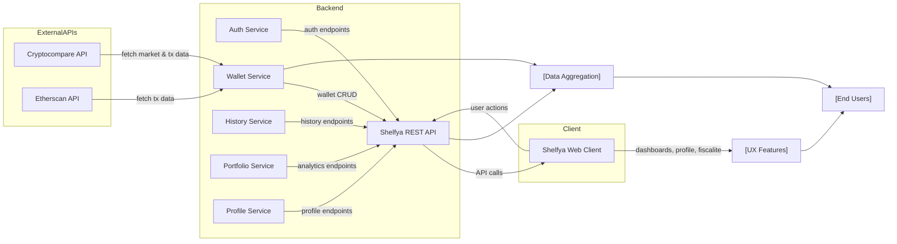

# Shelfya Wallet Tracking System

## Overview
Shelfya is an all-in-one wallet tracker that enables users to aggregate, view, and analyze their cryptocurrency portfolios. The system centralizes account management, wallet tracking, transaction history, and crypto portfolio analytics by integrating third-party APIs (Cryptocompare, Etherscan). It provides both a REST API for backend operations and a web client for user interactions.

## Key Features

- **User Authentication & Management**: Allows users to register, verify their email, login, logout, and manage their profile securely.
- **Wallet Aggregation**: Users can add, view, and delete multiple crypto wallets, centralizing their cryptocurrency holdings.
- **Transaction History & Analytics**: Fetches, visualizes, and provides statistics on wallet transactions.
- **API Integration**: Connects to external cryptocurrency APIs (Cryptocompare, Etherscan) to fetch up-to-date market and transaction data.
- **Client Dashboard**: Web client provides dashboards, profile management, tax area, and transaction graphing for users.
- **PDF Tax Reports**: Generates fiscal summaries (PDF export) for personal accounting (static, not API connected).

## System Errors

- **Authentication Error**: Occurs when missing or invalid access tokens are supplied.  
  _Resolution_: Re-authenticate and ensure the access token is present and valid.
- **Wallet Not Found**: Wallet ID does not exist or is invalid.  
  _Resolution_: Confirm and supply a valid wallet ID.
- **Email Verification Error**: Invalid or expired email verification token.  
  _Resolution_: Request a new verification email.
- **External API Failure**: Failure in communicating with Cryptocompare/Etherscan (network issues or API limits).  
  _Resolution_: Retry after some time; monitor API status limits.
- **Profile Update Error**: Invalid data or credentials when attempting to update profile.  
  _Resolution_: Ensure all required fields are completed and credentials are accurate.

## Usage Examples

```http
# Register a new user
POST /api/v1/auth/register
Content-Type: application/json
{
  "email": "user@example.com",
  "password": "securePassword123"
}

# Login
POST /api/v1/auth/login
Content-Type: application/json
{
  "email": "user@example.com",
  "password": "securePassword123"
}

# Add a wallet
POST /api/v1/
Content-Type: application/json
Authorization: Bearer <token>
{
  "walletAddress": "0x1234abcd..."
}

# Get wallet history
GET /api/v1/history/<walletId>
Authorization: Bearer <token>

# Access dashboard (Client)
GET /dashboard
```

## System Integration

