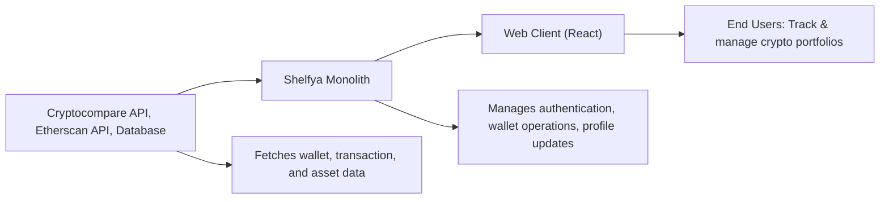

# Shelfya Monolith Overview

## Overview
Shelfya is an all-in-one wallet tracker designed to help users manage, visualize, and analyze their cryptocurrency portfolios. The application consolidates authentication, wallet management, and profile features, providing a consistent interface via RESTful APIs and an integrated web client. It leverages third-party APIs (Cryptocompare, Etherscan) to fetch live wallet data and insights, supporting individual users in overseeing their assets and history securely.

## Key Features

- **User Authentication System**: Enables account registration, email verification, login/logout, and secure token refresh to protect user actions and data.
- **Wallet Management**: Lets users add, list, and delete wallets, and provides transaction history and statistic insights per wallet.
- **Profile Management**: Allows users to view and update their profile or reset their password.
- **Dashboard & Visualization**: The client offers summary dashboards, profile views, fiscal reports (PDF generation), and graphical transaction views.
- **API Integration**: Connects to Cryptocompare and Etherscan for fetching asset information and transaction data.

## System Errors

- **Authentication Error**: Occurs when credentials are invalid or tokens have expired.
  - _Resolution_: Re-login or use token refresh endpoint.
- **Wallet Not Found**: Triggered when accessing a non-existent wallet.
  - _Resolution_: Verify wallet ID or create a new wallet.
- **API Connectivity Issue (Third-Party)**: Failure to retrieve data from Cryptocompare/Etherscan.
  - _Resolution_: Check network, API keys, or try again later.
- **Profile Update Conflict**: Occurs when invalid profile data is submitted.
  - _Resolution_: Ensure payload matches required format/specifications.

## Usage Examples

```javascript
// Registering a new user via API
fetch('/api/v1/auth/register', {
  method: 'POST',
  body: JSON.stringify({ email: "user@example.com", password: "securePassword" }),
  headers: { 'Content-Type': 'application/json' }
});

// Adding a wallet
fetch('/api/v1/', {
  method: 'POST',
  body: JSON.stringify({ address: "0x123..." }),
  headers: { 'Authorization': 'Bearer YOUR_TOKEN' }
});

// Viewing dashboard in client (React example)
import { useEffect } from 'react';

function Dashboard() {
  useEffect(() => {
    // Fetch wallet stats
    fetch('/api/v1/portfolio/myWalletId')
      .then(res => res.json())
      .then(stats => /* render stats */);
  }, []);
  // ...
}
```

## System Integration


