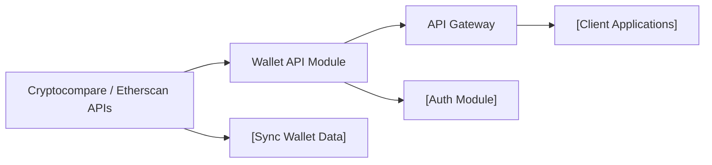

# Wallet API Module

## Overview
The Wallet API Module provides endpoints enabling users to manage, monitor, and analyze their cryptocurrency wallets. It acts as the gateway for creating wallets, retrieving wallet lists, viewing transaction history, and accessing wallet-specific statistics. This module integrates with upstream data providers (such as Cryptocompare and Etherscan) to aggregate, normalize, and expose wallet data to client applications via a RESTful interface.

## Key Features
- **Wallet Creation**: Allows users to create new cryptocurrency wallets in the system, initializing tracking and analysis.
- **Wallet Listing**: Retrieves all wallets associated with a user account, supporting portfolio-level visibility.
- **Wallet Deletion**: Enables users to permanently remove wallets from their profile and system tracking.
- **Wallet History Retrieval**: Provides access to detailed transaction history for a specific wallet, useful for tracking and analysis.
- **Wallet Statistics**: Delivers aggregated metrics and statistical insights for a selected wallet, empowering portfolio performance monitoring.

## System Errors
- **WalletNotFound**: Attempted access to a wallet that does not exist or is not owned by the currently authenticated user.
  - *Resolution*: Confirm the wallet ID and ensure you are authenticated under the correct user account.
- **DuplicateWallet**: Trying to create a wallet that already exists in the user's portfolio.
  - *Resolution*: Use the existing wallet entry or try creating a wallet with a unique identifier.
- **ExternalDataSourceError**: Failure when synchronizing with upstream providers (e.g., Cryptocompare or Etherscan).
  - *Resolution*: Retry after some time; check upstream provider status.
- **UnauthorizedAccess**: Attempt to access or modify wallets without valid authentication.
  - *Resolution*: Ensure valid authentication tokens are provided; log in again if needed.

## Usage Examples

```http
// Create a new wallet
POST /api/v1/wallet
Content-Type: application/json
Authorization: Bearer <access_token>

{
  "address": "0xABC123...xyz",
  "name": "MyMainWallet"
}

// Get user's wallets
GET /api/v1/wallet
Authorization: Bearer <access_token>

// Delete a wallet
DELETE /api/v1/wallet/<walletId>
Authorization: Bearer <access_token>

// Get wallet history
GET /api/v1/wallet/history/<walletId>
Authorization: Bearer <access_token>

// Get wallet statistics
GET /api/v1/wallet/portfolio/<walletId>
Authorization: Bearer <access_token>
```

## System Integration


