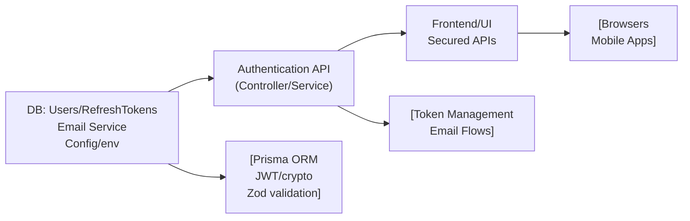

# Authentication API

## Overview

The Authentication API module manages user authentication workflows, including registration, login, email verification, secure token issuance (access and refresh tokens), refresh mechanisms, and logout. It provides the main authentication integration points for both frontend consumers and internal system components, acting as the foundation for secure user identity and session management throughout the application.

## Key Features

- **User Registration**: Allows new users to sign up using their email, password, and name. Handles password complexity validation and prevents duplicate registration.
- **User Login**: Authenticates users by verifying credentials, ensures email verification, and issues access and refresh tokens on successful login.
- **Email Verification**: Sends verification emails upon registration and processes email verification tokens to activate user accounts.
- **Access & Refresh Token Issuance**: Generates and manages short-lived access tokens and secure refresh tokens for maintaining user sessions.
- **Token Refresh**: Enables clients to securely refresh access tokens using valid refresh tokens, supporting seamless session renewal.
- **User Logout**: Handles session termination by invalidating refresh tokens and clearing related cookies.

## System Errors

- **ValidationError (400 Bad Request)**: Returned when required fields are missing or improperly formatted (e.g., email or password does not meet schema requirements).  
  _Resolution_: Ensure the request body matches the schema for registration, login, or token refresh.
- **UnauthorizedError (401 Unauthorized)**: Returned when authentication fails, such as invalid credentials, unverified email, or invalid/expired tokens.  
  _Resolution_: Check credentials, verify email, and ensure correct/valid tokens are sent in the request.
- **ConflictError (409 Conflict)**: Occurs if a user attempts to register with an email that is already in use.  
  _Resolution_: Use a different email for registration.
- **TokenExpiredError (401/403 Unauthorized)**: Returned when a refresh token is expired or invalid.  
  _Resolution_: Log in again to obtain new tokens if refresh tokens have expired.
- **InternalServerError (500 Internal Server Error)**: Indicates unexpected failures, such as issues with the email service or the persistence layer.  
  _Resolution_: Retry or contact support; inspect logs for more information.

## Usage Examples

```typescript
// Registration
await api.post('/api/auth/register', {
  email: "user@example.com",
  password: "StrongP@ssw0rd",
  name: "User Name"
});
// → { message: "Registration successful. Please verify your email." }

// Login
const response = await api.post('/api/auth/login', {
  email: "user@example.com",
  password: "StrongP@ssw0rd"
});
// response.data: { accessToken: "..." }
// (refreshToken is set as an HttpOnly cookie)

// Email Verification (typically accessed via email link)
await api.get('/api/auth/verify/:token');
// → { message: "Email verified successfully" }

// Refresh Access Token (using refresh token cookie)
await api.post('/api/auth/refresh');
// response.data: { accessToken: "..." }

// Logout (invalidates refresh token & clears cookie)
await api.post('/api/auth/logout');
// → { message: "Logged out successfully" }
```

## System Integration


