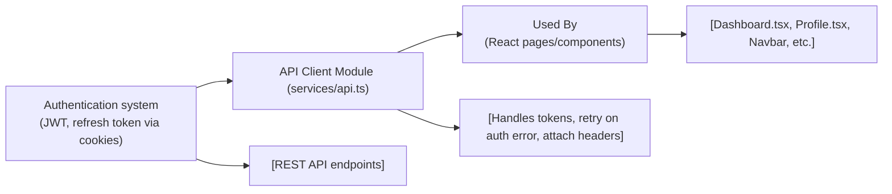

# API Client Module

## Overview
The API Client module provides a centralized, secure, and consistent mechanism to perform HTTP requests from the frontend React application to the backend REST API. It manages authentication tokens (including auto-refresh when expired), attaches necessary authorization headers, and standardizes error handling. This ensures that all parts of the application (pages and components) can interact with protected and public API endpoints seamlessly.

## Key Features

- **Authenticated HTTP Requests**:  
  Outgoing requests are automatically enriched with the user's authentication token (JWT), allowing secure access to protected endpoints.
  
- **Automatic Token Refresh**:  
  Handles 401/403 responses by transparently re-authenticating users using a refresh token (via /auth/refresh) and retrying the failed request.

- **Centralized Error Handling**:  
  Standardizes network and authentication error handling, including user redirection to the login page when sessions expire.

- **Token Lifecycle Management**:  
  Stores, retrieves, and removes the user's access token from local storage. Ensures token state is up-to-date and consistent throughout the app.

- **Global Integration Point**:  
  Exposes a single API object consumed throughout the app (e.g., in Dashboard, Profile, Navbar). This minimizes code duplication and enforces best security practices.

## System Errors

- **401/403 Unauthorized**:  
  - **Description**: The current JWT is missing, expired, or invalid.
  - **Resolution**: The client will attempt to refresh the token automatically. If refreshing fails, the user session is cleared and the app will redirect to the login page after a short delay.
  
- **Token Refresh Failure**:  
  - **Description**: The refresh token is invalid or expired, or the /auth/refresh endpoint is unreachable.
  - **Resolution**: The client clears the token, waits briefly, and then forces a redirect to the login page, requiring re-authentication.

- **Network/Server Errors**:  
  - **Description**: API requests may fail due to network issues or server-side errors.
  - **Resolution**: The error is propagated and should be handled by the calling component (e.g., displaying an error message or fallback UI).

## Usage Examples

```typescript
import API from "services/api";

// Example: Fetch wallets for the current user
const fetchWallets = async () => {
  const response = await API.get("/wallet");
  return response.data; // Array of wallet objects
};

// Example: Fetch portfolio for a given wallet
const getPortfolio = async (walletId: number) => {
  const response = await API.get(`/portfolio/${walletId}`);
  return response.data; // Portfolio data object
};

// Example: Update user profile
const updateProfile = async (payload: { name: string; email: string }) => {
  const response = await API.patch("/profile", payload);
  return response.data; // Updated profile
};

// Example: Remove the current wallet
const deleteWallet = async (walletId: number) => {
  await API.delete(`/wallet/${walletId}`);
};
```

## System Integration


