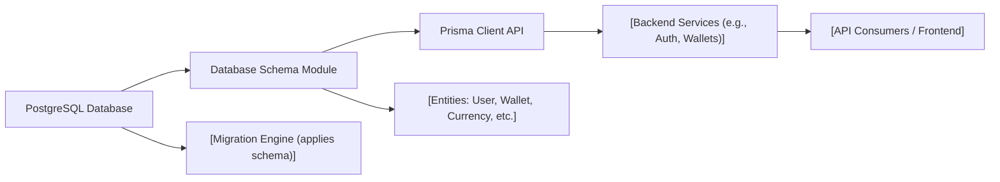

# Database Schema Module

## Overview
The Database Schema module defines the core data structures and relationships for the system using Prisma ORM, targeting a PostgreSQL backend. It provides a unified and consistent representation of users, wallets, currencies, authentication tokens, and associated histories. This schema underpins authentication, asset management, and historical tracking features across the platform.

## Key Features
- **User Management**: Supports user account creation, role assignment (ADMIN/USER), email verification status, and secure password storage.
- **Authentication Tokens**: Implements a refresh token mechanism for session management, associated with user accounts and supporting expiration handling.
- **Wallet Tracking**: Enables users to register multiple digital wallets, each with unique addresses and descriptive titles.
- **Wallet History Logging**: Records point-in-time wallet balances and values, capturing historical asset quantities and their associated currencies.
- **Currency Reference**: Maintains a catalog of supported currencies with unique symbols and names, referenced by wallet histories.
- **Currency Price History**: Stores time-stamped price values for each currency, supporting historical value computations and analytics.
- **Relational Integrity**: Enforces strong relations through foreign keys between users, wallets, tokens, currencies, and histories to ensure data consistency.

## System Errors
- **Unique Constraint Violation**: Attempting to create duplicate entries for unique fields (such as email, wallet address, currency symbol, or token) results in database errors.
  - *Resolution*: Ensure input data is unique before insertion; handle database error responses gracefully in the application layer.
- **Foreign Key Constraint Violation**: Operations that reference non-existent users, wallets, or currencies will fail.
  - *Resolution*: Validate existence of referenced records prior to insert/update operations; handle exceptions to prevent orphaned or inconsistent data.
- **Required Field Missing**: Inserting or updating records without required fields (i.e., non-nullable columns without defaults) triggers validation errors.
  - *Resolution*: Always supply values for required fields as defined in the schema.

## Usage Examples

```typescript
// Create a new user
const user = await prisma.user.create({
  data: {
    email: "user@example.com",
    password: "hashed-password",
    name: "Jane Smith"
  }
});

// Add a wallet for the user
const wallet = await prisma.wallet.create({
  data: {
    address: "0xabc123...",
    title: "Primary Wallet",
    userId: user.id
  }
});

// Record a wallet history entry
await prisma.walletHistory.create({
  data: {
    date: new Date(),
    quantity: 1.25,
    value: 450.00,
    currencyId: 1, // e.g., USD or BTC
    walletId: wallet.id
  }
});

// Create a currency and its price history
const currency = await prisma.currency.create({
  data: { symbol: "BTC", name: "Bitcoin" }
});

await prisma.currencyHistory.create({
  data: {
    date: new Date(),
    price: 40000.00,
    currencyId: currency.id
  }
});
```

## System Integration


