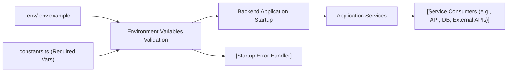

# Environment Variables Validation

## Overview
This module ensures that all necessary environment variables are present and properly configured before starting the backend application. It serves as a safeguard—preventing misconfiguration at deployment or runtime—by verifying required environment variables critical for database connectivity, authentication, API integrations, and core service operation.

## Key Features

- **Mandatory Environment Validation**: Validates the presence and non-emptiness of all environment variables required for backend operation at startup.
- **Fails Fast**: Immediately stops the application launch if any required environment configuration is missing, surfacing clear error messages.
- **Centralized Configuration Awareness**: Lists all required variables in one place, aiding setup, debugging, and system maintainability.

## System Errors

- **Missing or Empty Environment Variables**: 
  - **Description**: Application startup fails with an error if any required environment variable is not set or is empty.
  - **Resolution**: Check and define all required environment variables according to the documentation or `.env.example` file before (re)starting the server.
- **Invalid Configuration**: 
  - **Description**: If the configuration does not meet operational requirements (e.g., incorrect database URL format), downstream services will likely fail even if not directly surfaced by this validation.
  - **Resolution**: Confirm variable formats (especially for connection URLs and secret keys) using provided examples and backend logs.

## Usage Examples

```typescript
// Integrating at the entry point of your backend application
import { verifyEnv } from './utils/verify-env';

// Call before any server/db initialization
verifyEnv();

// Proceed with server start-up only if verification passes
initializeDatabase();
startServer();
```

**Example error output:**
```
Error: Missing or empty required environment variables: JWT_ACCESS_SECRET, SMTP_HOST, DATABASE_URL
```

## System Integration


