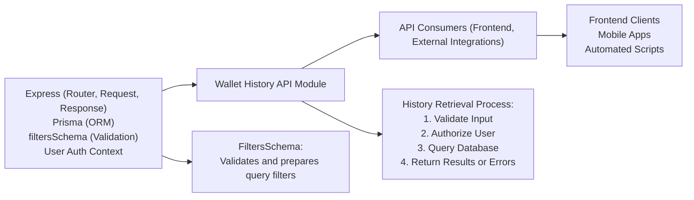

# Wallet History API

## Overview
The Wallet History API module provides endpoints for retrieving a user's wallet transaction history. It serves as a bridge between the client applications and the underlying data store, enforcing filtering and access control so users can securely fetch their transaction history. This module is integral for users who wish to audit, review, or analyze past wallet activity in real time.

## Key Features
- **Retrieve Wallet History**: Fetches historical transactions for a specific user wallet, filtered by optional criteria such as start date.
- **Access Control**: Ensures users can only access their own wallet history, maintaining privacy and data security.
- **Flexible Filtering**: Supports querying history based on parameters like `startDate` to enable time-based transaction analysis.
- **Robust Error Reporting**: Communicates precise errors for invalid requests or missing data, aiding in troubleshooting and rapid integration.

## System Errors
- **Invalid Wallet ID**: Returned when the supplied wallet ID in the request is not a valid number.  
  _Resolution_: Verify that the `id` parameter is a numeric value.
- **Wallet History Not Found**: Returned when no history entries exist for the requested wallet.  
  _Resolution_: Ensure the wallet exists and has transaction history.
- **Internal Server Error**: Covers all unexpected system errors or exceptions.  
  _Resolution_: Check server logs for more details and report issues to system maintainer if persistent.

## Usage Examples

```javascript
// Fetch wallet history using a REST GET request

// Route: GET /history/:id?startDate=2023-01-01

fetch('/history/123?startDate=2023-01-01', {
  method: 'GET',
  headers: {
    Authorization: 'Bearer <token>' // User must be authenticated
  }
})
  .then(response => response.json())
  .then(data => {
    // data is an array of history records associated with wallet 123 since 2023-01-01
    console.log(data);
  })
  .catch(error => {
    // Handle error conditions (e.g., invalid wallet id, not found, internal error)
    console.error(error);
  });
```

## System Integration


