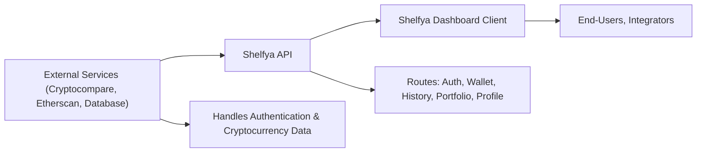

# API Overview

## Overview
The Shelfya API serves as the backbone for a cryptocurrency wallet tracking system, providing secure user authentication, wallet management, transaction history, profile operations, and portfolio analytics. Its primary role is to manage user accounts, allow users to create and monitor multiple wallets, and offer actionable insights by interfacing with external crypto data providers. The API is RESTful and is meant to be consumed by a client-side dashboard and other integration points.

## Key Features

- **User Authentication & Session Management**: 
  Supports registration, login, logout, email verification, and session refresh to facilitate secure user access.

- **Wallet Management**: 
  Users can create, list, and delete wallets, allowing for personalized tracking of multiple cryptocurrency wallets.

- **Transaction History**: 
  Retrieves historical transaction data for each wallet, helping users monitor their activity and track assets over time.

- **Portfolio Analytics**:
  Provides aggregated portfolio statistics per wallet, enabling users to analyze performance and make informed decisions.

- **Profile Management**: 
  Users can view and update their profile information, including sensitive actions like password resets.

## System Errors

- **Authentication Error**: 
  Occurs when access tokens are missing, expired, or invalid.  
  _Resolution_: Re-authenticate or refresh the access token using `/auth/refresh-access-token`.

- **Validation Error**: 
  Triggered by missing or invalid input data (e.g., registration, wallet creation).  
  _Resolution_: Verify input fields and request structure match the API's requirements.

- **Resource Not Found**: 
  Returned when accessing wallets, history, or portfolios for non-existent or unauthorized IDs.  
  _Resolution_: Ensure the referenced ID exists and belongs to the authenticated user.

- **Rate Limit Exceeded**: 
  Triggered when too many requests are made in a short time (e.g., login/register endpoints).  
  _Resolution_: Wait and retry after some time, or reduce request frequency.

## Usage Examples

```javascript
// Register a new user
await axios.post('/api/v1/auth/register', { email: 'alice@example.com', password: 'securepass' });

// Login and obtain access token
const { data } = await axios.post('/api/v1/auth/login', { email: 'alice@example.com', password: 'securepass' });
const accessToken = data.token;

// Create a new wallet (authenticated)
await axios.post('/api/v1/wallet/', { name: 'My Wallet', address: '0x...' }, {
  headers: { 'Authorization': `Bearer ${accessToken}` }
});

// Get transaction history for a wallet (authenticated)
await axios.get('/api/v1/history/{walletId}', {
  headers: { 'Authorization': `Bearer ${accessToken}` }
});

// Fetch portfolio analytics for a wallet
await axios.get('/api/v1/portfolio/{walletId}');
```

## System Integration


