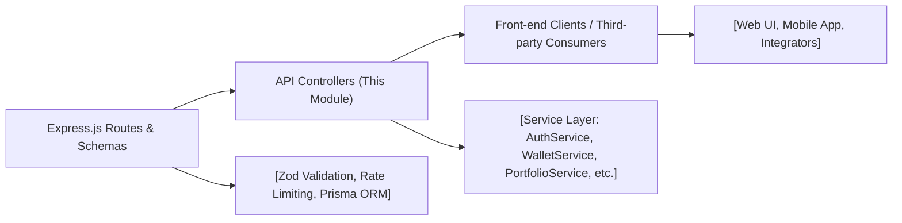

# API Overview

## Overview
This module provides the core HTTP API endpoints for authentication, user profiles, portfolio information, wallet management, and historical data retrieval within the Shelfya platform. It exposes RESTful endpoints, validates incoming requests, and coordinates with service layers to implement required business logic, ensuring secure and organized access to user financial data and account features.

## Key Features

- **Authentication API**: 
  - Secure login, registration, logout, and token refresh mechanisms.
  - Email verification and access token management.
  - Enforces security headers and stores refresh tokens using HttpOnly cookies.

- **Portfolio API**: 
  - Retrieves allocation, price data, values, and historical pricing for a user's wallet.
  - Organizes and delivers insights about asset distribution and trends.

- **Wallet Management API**: 
  - Create, delete, and list wallets tied to a user account.
  - Ensures validation and ownership before modification.

- **History API**: 
  - Fetches transactional or price history for a specific wallet.
  - Supports date-based filtering and secure user access.

- **Profile API**: 
  - Retrieve and edit user profile information (email, name).
  - Enables password resets with secure password validation.

## System Errors

- **Validation Error**: 
  - *Description*: Input does not meet expected schema (e.g., invalid email, short password).
  - *Resolution*: Check and correct the submitted data according to schema requirements.

- **Authentication Error**: 
  - *Description*: Invalid credentials or missing/expired tokens.
  - *Resolution*: Ensure correct login details and valid/active tokens; repeat login or refresh as required.

- **Resource Not Found**: 
  - *Description*: Attempted to access a wallet, profile, or history that does not exist or doesn't belong to the user.
  - *Resolution*: Verify resource identifiers and ownership, or create missing wallets/accounts.

- **Email Already Registered**: 
  - *Description*: Email is already registered during account creation.
  - *Resolution*: Use a different email or recover the existing account.

- **Database Constraint Error (Profile/Wallet)**:
  - *Description*: Conflicting unique profile or wallet operation (e.g., email/wallet address already used).
  - *Resolution*: Ensure uniqueness and correctness of provided data before retrying.

- **Internal Server Error**: 
  - *Description*: An unexpected failure in the backend or service layer.
  - *Resolution*: Check server logs for details; may require technical support if persistent.

## Usage Examples

```typescript
// User Login
POST /api/auth/login
{
  "email": "user@example.com",
  "password": "StrongPassword123!"
}

// Refresh Access Token
POST /api/auth/refresh-access-token
// (Requires 'refreshToken' cookie)

// Register
POST /api/auth/register
{
  "email": "user@example.com",
  "password": "StrongPassword123!",
  "name": "John Doe"
}

// Get Portfolio
GET /api/portfolio/1
// Returns allocation, value, and price data for wallet with ID 1

// Create Wallet
POST /api/wallet
{
  "address": "0x123456...",
  "title": "My ETH Wallet"
}

// Fetch Wallet History (with optional date filter)
GET /api/history/1?startDate=2024-01-01

// Update User Profile
PATCH /api/profile
{
  "email": "new@example.com",
  "name": "Jane Doe"
}

// Change Password
PATCH /api/profile/password
{
  "oldPassword": "OldPass!",
  "newPassword": "NewPass!2024"
}
```

## System Integration


