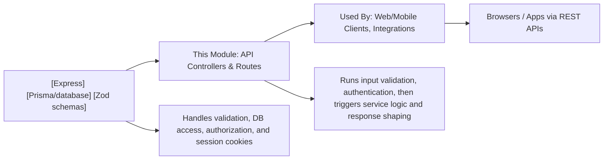

# API Overview

## Overview
The API provides a cohesive set of endpoints for user authentication, profile management, wallet operations, portfolio insights, and transaction history within the Shelfya platform. It acts as the foundation for secure user access, personal data management, digital wallet control, and portfolio tracking, enabling seamless integration with frontend clients and external systems.

## Key Features
- **User Authentication**: Handles secure registration, login, logout, and token refresh, ensuring protected access to the platform.
- **Email Verification**: Supports registration with email confirmation to validate user accounts.
- **Profile Management**: Allows users to retrieve, edit their profile details, and reset their passwords.
- **Wallet Management**: Provides endpoints for creating, retrieving, and deleting digital wallets associated with user accounts.
- **Portfolio Insights**: Delivers current allocation, asset prices, and value trends for each wallet’s portfolio.
- **Transaction History**: Enables retrieval of filtered historical wallet transactions for account reconciliation and analysis.
- **Input Validation**: Schemas are used extensively to validate request payloads to maintain data integrity and security.

## System Errors
- **Validation Errors**: Occur when input data does not conform to the required schema.  
  _Resolution_: Ensure all required fields are present and properly formatted.
- **Authentication Errors**: Triggered by invalid credentials, missing/expired tokens, or when attempting unauthorized actions.  
  _Resolution_: Re-authenticate, ensure cookies/tokens are included and not expired.
- **Resource Not Found**: Returned when requested wallets, portfolio data, or history do not exist.  
  _Resolution_: Verify resource identifiers/parameters; ensure the user has access rights.
- **Duplicate Resource/Email**: Attempting to register or modify a profile/email that already exists.  
  _Resolution_: Use a unique email for registration/profile updates.
- **Internal Server Error**: Indicates unhandled server exceptions.  
  _Resolution_: Review error message, retry, or contact support if persistent.

## Usage Examples

```js
// User Registration
const response = await fetch('/api/auth/register', {
  method: 'POST',
  body: JSON.stringify({ name: 'Alice', email: 'alice@example.com', password: 'Secur3!Pass' }),
  headers: { 'Content-Type': 'application/json' }
});
// Response: { message: "Registration successful. Please verify your email." }

// Login and receive access token
const response = await fetch('/api/auth/login', {
  method: 'POST',
  body: JSON.stringify({ email: 'alice@example.com', password: 'Secur3!Pass' }),
  headers: { 'Content-Type': 'application/json' }
});
// Response: { accessToken: "..." }, HttpOnly refresh token set in cookie

// Fetch user profile (authenticated)
const response = await fetch('/api/profile', {
  headers: { Authorization: 'Bearer ACCESS_TOKEN' }
});
// Response: { id: 1, email: 'alice@example.com', name: 'Alice', ... }

// Create a new wallet
const response = await fetch('/api/wallet', {
  method: 'POST',
  body: JSON.stringify({ address: '0x123...', title: 'Main Wallet' }),
  headers: { 'Content-Type': 'application/json', Authorization: 'Bearer ACCESS_TOKEN' }
});
// Response: { id: 1, address: '0x123...', title: 'Main Wallet', ... }

// Get wallet portfolio overview
const response = await fetch('/api/portfolio/1', {
  headers: { Authorization: 'Bearer ACCESS_TOKEN' }
});
// Response: { allocation: {...}, price: {...}, dailyPrice: {...}, value: {...}, dailyValue: {...} }

// Retrieve wallet transaction history
const response = await fetch('/api/history/1?startDate=2023-01-01', {
  headers: { Authorization: 'Bearer ACCESS_TOKEN' }
});
// Response: [ { date: ..., amount: ..., ... }, ... ]
```

## System Integration


