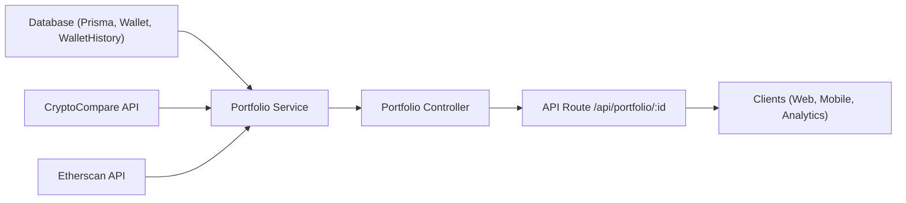

# Portfolio API Module

## Overview
The Portfolio API module provides endpoints to retrieve real-time and historical portfolio statistics for a specific wallet. It aggregates wallet allocation, current price, historical price, current value, and daily value changes for cryptocurrency portfolios. This module serves as the main integration point for clients or systems wishing to display or analyze user wallet performance benchmarks.

## Key Features
- **Portfolio Retrieval**: Returns a comprehensive snapshot of a wallet's portfolio, including allocation, current cryptocurrency price, daily price change, current total value, and change in value over the last day.
- **Real-Time Data Aggregation**: Fetches current and historical cryptocurrency pricing from external providers to ensure real-time and accurate portfolio insights.
- **Integration with Wallet Histories**: Leverages stored wallet histories to compute daily value changes, offering users insight into recent portfolio movement.

## System Errors
- **INTERNAL_SERVER_ERROR**: Triggered by upstream network failures, data fetch problems, or unexpected computation issues. Returns a message indicating the backend error reason.
  - **Resolution**: Verify external API availability (CryptoCompare, Etherscan), wallet existence, and system environment variables (e.g., ETHERSCAN_API_KEY).
- **Wallet Not Found**: If the provided wallet ID is not found in the system, the response may lack expected data.
  - **Resolution**: Ensure the wallet ID is correct and exists in the system's database.

## Usage Examples

```typescript
// Fetch a wallet's portfolio overview via HTTP GET
fetch('/api/portfolio/123')
  .then(response => response.json())
  .then(data => {
    /**
     * {
     *   "allocation": 1,
     *   "price": 3500.50,
     *   "dailyPrice": 2.45,
     *   "value": 5.25,
     *   "dailyValue": 0.10
     * }
     */
  });

// Express route usage (server-side)
app.get('/api/portfolio/:id', portfolioController.get);
```

## System Integration


