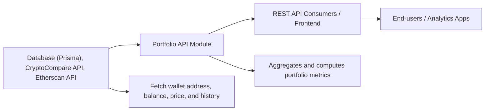

# Portfolio API

## Overview
The Portfolio API module provides portfolio-related data for a specific wallet within the system. It exposes a public HTTP endpoint to retrieve details such as asset allocation, current and historical price information, and wallet value metrics. This module acts as the system’s gateway for portfolio insights, aggregating live data from external crypto services and internal transaction history to deliver a unified read model of a user's portfolio.

## Key Features
- **Portfolio Overview Endpoint**: Exposes a GET route to fetch portfolio allocation, current price, value, and relevant historical comparisons for a given wallet.
- **Real-time Price Integration**: Aggregates live asset pricing and historical data from external crypto APIs (e.g., CryptoCompare, Etherscan).
- **Wallet Value Analytics**: Calculates the wallet's value in target currency, including day-over-day changes, by merging live values with historical records.

## System Errors
- **INTERNAL_SERVER_ERROR**: Returns when the module fails to retrieve wallet data, external price feeds, or any downstream service error.  
  _Resolution_: Ensure all required APIs (CryptoCompare, Etherscan) are reachable and valid API keys are configured. Verify the wallet exists in the system and that the database connection is active.

- **Portfolio Not Found**: If the requested wallet ID does not exist in the database, portfolio data cannot be resolved.  
  _Resolution_: Confirm that the provided wallet ID is valid and correctly onboarded.

## Usage Examples

```typescript
// Fetch portfolio data for wallet with id = 1 using an HTTP client (e.g., fetch)
import fetch from "node-fetch";

const walletId = 1;
fetch(`https://<host>/portfolio/${walletId}`)
  .then(res => res.json())
  .then(data => {
    // Expected data structure:
    // {
    //   allocation: number,
    //   price: number,
    //   dailyPrice: number,
    //   value: number,
    //   dailyValue: number
    // }
    console.log(data);
  })
  .catch(err => console.error("Error fetching portfolio:", err));

// Sample response:
// {
//   allocation: 1,
//   price: 3700.5,
//   dailyPrice: 1.89,
//   value: 2.7,
//   dailyValue: 0.21
// }
```

## System Integration


