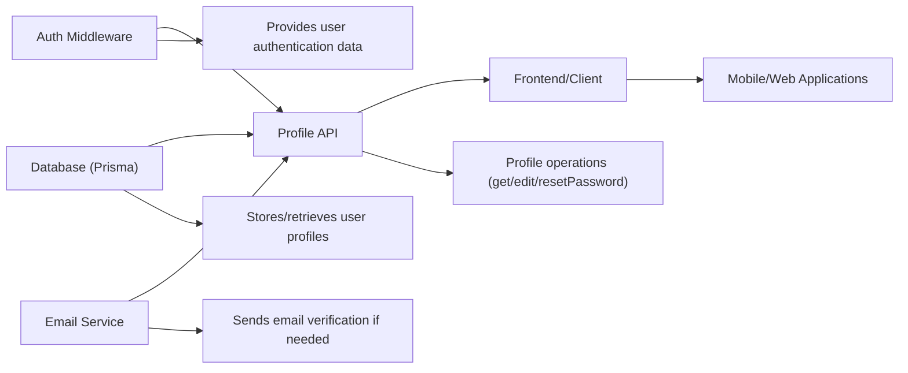

# Profile API

## Overview
The Profile API module manages user profile operations such as retrieving profile data, editing user information (name and email), and resetting account passwords. It acts as the public entry point for profile management within the system, providing secure HTTP endpoints for authenticated users to view and update their own profile information. It also ensures email verification when email addresses change and enforces strong password requirements.

## Key Features
- **Get User Profile**: Allows authenticated users to retrieve their current profile data (name and email).
- **Edit Profile**: Enables users to update their name and email. Triggers email verification if the email changes.
- **Reset Password**: Permits users to change their account password with validation to ensure security and correctness.
- **Input Validation**: Strictly validates input for profile editing and password resetting, enforcing email formats and strong password policies.

## System Errors
- **Invalid Email or Missing Fields**:  
  - *Description*: Attempting to update profile without providing an email, or with invalid email formatting.  
  - *Resolution*: Ensure that a valid email field is entered in the request body.

- **Email Already In Use (Edit Profile)**:  
  - *Description*: When attempting to change the email to one already registered in the system, the update will fail.  
  - *Resolution*: Use an email address that is not currently associated with another account.

- **Password Update - Missing Fields**:  
  - *Description*: Attempting to reset a password without providing both oldPassword and newPassword fields, or providing the same value for both.  
  - *Resolution*: Provide both fields and ensure the newPassword is different from oldPassword.

- **Password Policy Failure**:  
  - *Description*: Password fails to meet the required pattern (minimum 8 characters, uppercase, lowercase, number, special character).  
  - *Resolution*: Ensure the new password matches the strong password policy.

- **Old Password Incorrect**:  
  - *Description*: If the provided oldPassword does not match the current password.  
  - *Resolution*: Ensure the correct current password is entered.

- **Internal Server Error**:  
  - *Description*: Any unexpected error during profile operations.  
  - *Resolution*: Check server logs. Typically indicates a backend malfunction or dependency failure.

## Usage Examples

```typescript
// Get current user profile (Authenticated request)
GET /api/profile
Authorization: Bearer <access_token>

// Response:
{
  "name": "Jane Doe",
  "email": "jane.doe@example.com"
}

// Edit profile (Authenticated request)
PATCH /api/profile
Authorization: Bearer <access_token>
Content-Type: application/json

{
  "name": "Janet Doe",
  "email": "janet.doe@example.com"
}

// Response when successful:
{
  "id": 123,
  "name": "Janet Doe",
  "email": "janet.doe@example.com",
  "isEmailVerified": false // Email must be re-verified if changed
}

// Reset password (Authenticated request)
PATCH /api/profile/password
Authorization: Bearer <access_token>
Content-Type: application/json

{
  "oldPassword": "CurrentPassword123!",
  "newPassword": "NewSecurePassword456!"
}

// Response when successful:
{
  "message": "Password changed"
}

// Error example (missing email):
{
  "error": "Email is required"
}

// Error example (oldPassword missing or incorrect):
{
  "error": "Old password and new password are required"
}
// or
{
  "message": "Old password is incorrect"
}
```

## System Integration


