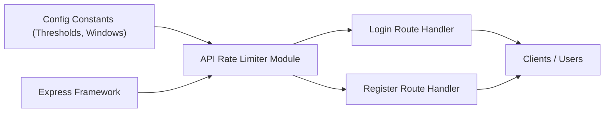

# API Rate Limiter

## Overview
The API Rate Limiter module restricts the number of requests that can be made to authentication-related endpoints (such as login and register) from a single IP address within a specified time window. This helps prevent brute-force attacks, spam, and abuse of authentication APIs, contributing to overall system security and reliability.

## Key Features
- **Login Rate Limiting**: Limits the number of login attempts allowed from each IP address within a configured time window. Protects against brute-force attacks on user credentials.
- **Registration Rate Limiting**: Restricts how many account creation attempts can be made from each IP address within a set time period. Reduces abuse of the registration process and helps prevent bot activity.
- **Customizable Thresholds**: Rate limits and window durations are centrally configured, making it easy to adjust thresholds according to security and usability needs.
- **IP-Aware Throttling**: Uses the real client IP address, even behind proxies, ensuring accurate attribution of requests for fair and secure enforcement.

## System Errors
- **429 Too Many Requests**: Returned when a client exceeds the allowed number of requests within the time window for login or registration.
  - **Resolution**: Advise the user to wait (typically 15 minutes) before attempting again. For persistent issues, review if legitimate requests are being misclassified and consider adjusting the threshold or time window.

## Usage Examples

```typescript
import { loginLimiter, registerLimiter } from "./middleware/rate-limiter";

// Use in Express app for login endpoint
app.post("/api/login", loginLimiter, loginHandler);

// Use in Express app for registration endpoint
app.post("/api/register", registerLimiter, registerHandler);
```

## System Integration


