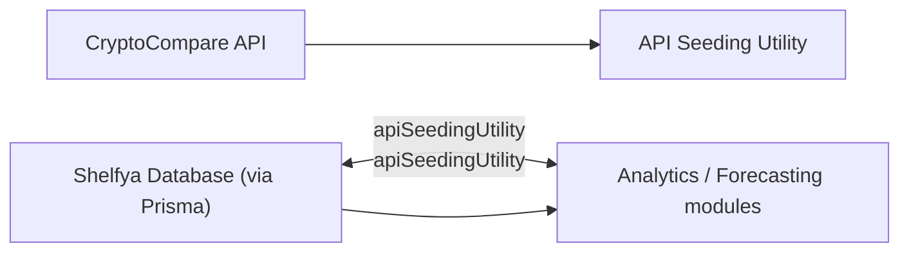

# API Seeding Utility

## Overview
The API Seeding Utility automates the initialization and reseeding of historical cryptocurrency price data within the Shelfya system database. It fetches and stores detailed price history from the CryptoCompare API, ensuring that the database contains up-to-date and relevant currency data for subsequent analytics, forecasting, or reference across other services.

## Key Features
- **Historical Data Fetching**: Retrieves extended daily historical price data for a selected cryptocurrency in a specified fiat currency using the CryptoCompare API.
- **Database Seeding**: Populates or updates currency and related historical prices within the Shelfya database, ensuring consistent and accurate data availability for downstream features or modules.
- **Database Cleanup**: Clears prior currency history entries, facilitating a fresh and consistent reseed, particularly useful during integration or system resets.

## System Errors
- **Data Fetch Failure**: If the external API is unreachable or returns an error, a console error will be logged.  
  _Resolution_: Ensure API key validity, network connectivity, and that the CryptoCompare API is available.
- **Database Operation Error**: Catches and logs any issues related to database deletion or upsert operations.  
  _Resolution_: Verify database connection details, ensure schema correctness, and confirm that Prisma is properly configured.
- **Invalid API Key**: If the `CRYPTOCOMPARE_API_KEY` environment variable is missing or invalid, API requests will fail.  
  _Resolution_: Add or update the API key in environment configuration.
- **Invalid Currency Entry**: Encountering malformed or incomplete data while seeding is logged and skipped.  
  _Resolution_: No action typically needed; the utility already handles and skips bad data.

## Usage Examples

```typescript
// Cleans all historical currency data
await cleanCurrencyHistory();

// Seeds database with Ethereum (ETH) to Euro (EUR) historical prices
await populateDb("ETH", "EUR");

// Use with any cryptocurrency supported by CryptoCompare, for example:
// await populateDb("BTC", "USD");
```

## System Integration


