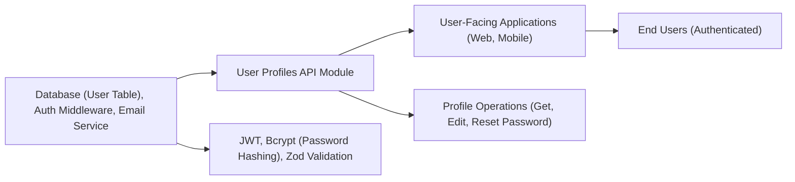

# User Profiles API

## Overview
The User Profiles module provides API endpoints for authenticated users to manage their account profile details, including viewing their profile, editing their information (name, email), and securely resetting their password. It serves as the core feature for user self-service account management in the system.

## Key Features
- **Get User Profile**: Retrieve the current user's profile details (name, email) based on their authentication context.
- **Edit User Profile**: Update the user's name and email; triggers verification if the email changes.
- **Reset Password**: Securely allows users to change their password by providing the old and new passwords.

## System Errors
- **Invalid Input**: Occurs if required fields (e.g., email for edit, passwords for reset) are missing or malformed.  
  *Resolution*: Ensure all required fields are provided and meet validation criteria.
- **Duplicate Email**: Attempting to update to an email already registered triggers a conflict.  
  *Resolution*: Use a different email address.
- **Incorrect Old Password**: When the provided old password does not match the current password.  
  *Resolution*: Provide the correct current password for password reset.
- **Internal Server Error**: General fallback for unexpected issues (e.g., database connection errors).  
  *Resolution*: Check backend logs for further diagnostics.

## Usage Examples

```typescript
// Get user profile (requires authentication)
GET /api/profile
// Response: { "name": "Jane Doe", "email": "jane@example.com" }

// Edit user profile (requires authentication)
PATCH /api/profile
Body: { "name": "Jane New", "email": "jane.new@example.com" }
// Response: updated user object

// Reset password (requires authentication)
POST /api/profile/reset-password
Body: {
  "oldPassword": "CurrentPassword#123",
  "newPassword": "NewPassword#456"
}
// Response: { "message": "Password changed" }
```

## System Integration


