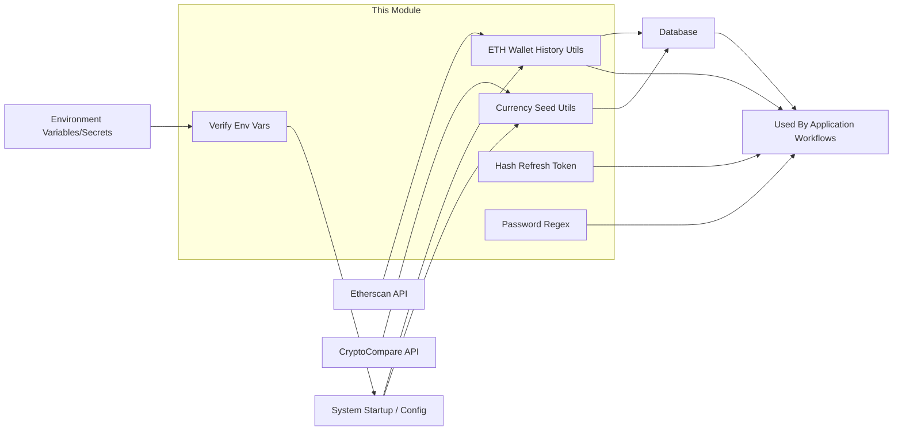

# Utilities Module

## Overview
The Utilities module provides a collection of support functions and validation utilities for core aspects of the system. These utilities handle interactions with external APIs (such as Etherscan and CryptoCompare), token hashing for secure refresh tokens, password pattern enforcement, and critical environment configuration verification for reliable operation.

## Key Features

- **Etherscan Wallet History Aggregation**:  
  Retrieves, aggregates, and normalizes a wallet's Ethereum transaction history, combining both standard and internal transactions using Etherscan APIs to produce daily balance changes.

- **Token Hashing**:  
  Produces a secure SHA-256 HMAC hash of a refresh token (or similar secret), intended for securely verifying tokens.

- **Password Format Validation**:  
  Enforces strong password policies with a regex that requires mixed cases, numbers, special characters, and a minimum length.

- **CryptoCompare Currency History Sync**:  
  Fetches historical price data for specified cryptocurrencies from CryptoCompare and synchronizes this data with the application's database, ensuring up-to-date price references.

- **Environment Variable Verification**:  
  Ensures all required environment variables are present and non-empty, preventing the system from starting in a misconfigured state.

## System Errors

- **Missing Required Environment Variables**:  
  - **Description**: The application cannot start due to absent or empty critical environment variables.
  - **Resolution**: Confirm all variables listed in `REQUIRED_ENV_VARS` are set in the deployment environment.

- **Failed Etherscan Requests**:  
  - **Description**: Etherscan API errors, such as rate limits, invalid API keys, or network issues, cause transaction history retrieval to fail.
  - **Resolution**: Verify network connectivity, API key validity, and check Etherscan's service status or API quota.

- **CryptoCompare Data Fetch Error**:  
  - **Description**: Fetching currency history from CryptoCompare fails due to API unavailability, invalid API key, or data issues.
  - **Resolution**: Ensure API key is valid, service is reachable, and requested currencies and time ranges are valid.

- **Database Operation Errors (Currency History Sync)**:  
  - **Description**: Errors during database upserts, possibly from schema mismatches or connection problems.
  - **Resolution**: Review database connectivity and schema consistency, and inspect error logs for specifics.

## Usage Examples

```typescript
// 1. Retrieve and compute daily Ethereum wallet balances from Etherscan
import { createWalletHistory } from './etherscan';

const walletHistory = await createWalletHistory("0x123...abcd");
// walletHistory: [{ walletId, date, value }, ...]

// 2. Generate a secure hash for a token
import { hashToken } from './hash-refresh-token';

const hashed = hashToken("user_refresh_token", "super_secret_salt");

// 3. Validate password strength using regex
import { passwordRegex } from './regex';

const password = "SuperSecret123!";
const isValid = passwordRegex.test(password);

// 4. Synchronize historical crypto prices (inside seed scripts)
import { populateDb } from './seed';

await populateDb("ETH", "USD");   // stores ETH-USD daily history

// 5. Validate environment configuration at application startup
import { verifyEnv } from './verify-env';

try {
  verifyEnv();
  // Safe to start server
} catch (e) {
  console.error("Configuration error:", e.message);
  process.exit(1); // Safe fail; required config missing
}
```

## System Integration


