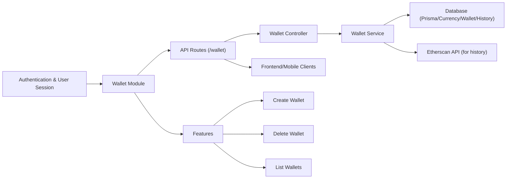

# Wallet Module

## Overview
The **Wallet Module** enables user-specific wallet management within the system, allowing users to create, fetch, and delete their cryptocurrency wallets. By integrating with Ethereum and fetching historical price data, the module enriches wallets with transaction history and their value over time. This module is the main system gateway for all wallet-related operations and ensures each wallet is securely associated with its owner.

## Key Features
- **Create Wallet**:  
  Users can add a new wallet by providing an address and a title. The module fetches and attaches the wallet's value history using historical ETH price data.  
  *Purpose*: Onboards new wallets and provides users with enriched wallet tracking.

- **List Wallets**:  
  Fetches all wallets associated with the authenticated user.  
  *Purpose*: Allows users to view and manage their entire wallet portfolio.

- **Delete Wallet**:  
  Removes a user wallet by ID and deletes associated value history data.  
  *Purpose*: Enables users to revoke access and erase wallet records from their profile.

## System Errors
- **Invalid Wallet ID**:  
  *Description*: The wallet deletion request uses a non-integer or missing wallet ID.  
  *Resolution*: Ensure the `id` parameter in the request URL is a valid number.

- **Address and Title Required**:  
  *Description*: Missing address or title in wallet creation payload.  
  *Resolution*: Provide both `address` and `title` fields in the request body.

- **Wallet Not Found (P2025 error)**:  
  *Description*: Attempted deletion targets a wallet that does not exist or does not belong to the user.  
  *Resolution*: Verify the wallet ID corresponds to an existing wallet owned by the requesting user.

- **ETH Currency Not Found**:  
  *Description*: Underlying currency data ("ETH") is missing in the database during wallet creation.  
  *Resolution*: Ensure ETH is present in the system currency records.

- **Internal Server Error**:  
  *Description*: An unexpected error occurred during wallet operations (create, list, or delete).  
  *Resolution*: Check server logs for further details and ensure backend dependencies are healthy.

## Usage Examples

```typescript
// Create a new wallet for the authenticated user
POST /wallet
Body: {
  "address": "0x123abc...",
  "title": "My Main Wallet"
}

// Sample successful response
{
  "id": 7,
  "userId": 42,
  "address": "0x123abc...",
  "title": "My Main Wallet"
}

// Retrieve all wallets associated with the authenticated user
GET /wallet

// Sample response
[
  { "id": 7, "address": "0x123abc...", "title": "My Main Wallet" },
  { "id": 8, "address": "0x987xyz...", "title": "Secondary" }
]

// Delete a user's wallet
DELETE /wallet/7

// Response: 204 No Content if successful
```

## System Integration


*(Replace "Wallet Module" with "This Module" if diagramming for a multi-module system.)*