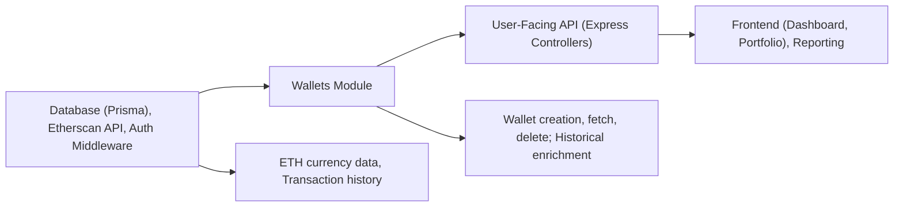

# Wallets Module

## Overview
The **Wallets Module** enables users to register, view, and delete their cryptocurrency wallets within the system. It provides endpoints for wallet management and ensures that each wallet is enriched with transaction history and valuation data, powering dashboards and portfolio tracking features. The module acts as the integration point between user identities, external blockchain data (Etherscan), and internal reporting on asset balances.

## Key Features
- **Create Wallet**: Registers a new user's wallet by address and title, fetching historical transactions and calculating daily value using Etherscan. Associates each wallet to a specific user account.
- **Fetch Wallets**: Lists all wallets belonging to the authenticated user, supporting multi-wallet management and portfolio tracking.
- **Delete Wallet**: Removes a wallet and all its historical data for the current user, ensuring privacy and data consistency.
- **Historical Value Calculation**: For each wallet, retrieves transactions (both normal and internal), computes daily balances, and enriches with historical ETH valuations for tracking portfolio value over time.
- **Data Normalization & Enrichment**: Aggregates transaction data into a normalized daily format, matched with historical exchange rates from the system’s database, enabling currency conversion and trend analysis.
- **API Security**: All wallet operations are available only to authenticated users and scoped to their user ID to protect data.

## System Errors
- **Invalid Wallet ID**: When deleting a wallet, a bad request error (`400`) is returned if the wallet ID is invalid.  
  **Resolution**: Ensure the wallet ID is a valid integer and corresponds to a wallet owned by the user.
- **Wallet Not Found**: On delete, if the wallet does not exist or doesn’t belong to the user, a not found error (`404`) is returned.
  **Resolution**: Verify the wallet is registered and belongs to the user before retrying.
- **Missing Address or Title**: On create, if required fields are missing, a bad request error (`400`) is returned.
  **Resolution**: Provide both `address` and `title` in the request body.
- **ETH Currency Not Found**: If ETH exchange rates are not present in the database, wallet creation fails with an internal server error.
  **Resolution**: Check that the currency and its history exist in the system before adding wallets.
- **Etherscan/API Issues**: Any issues fetching data from Etherscan or other services will result in an internal server error (`500`).
  **Resolution**: Ensure network connectivity and valid API keys; check logs for rate limit or connectivity issues.

## Usage Examples

```typescript
// Use authenticated Express routes for all wallet operations

// 1. Create a new wallet
POST /api/wallets
Body: {
  "address": "0x1234567890abcdef...",
  "title": "Main Portfolio"
}
/* 
  Response: 
  {
    "id": 3,
    "userId": 5,
    "address": "0x1234567890abcdef...",
    "title": "Main Portfolio"
  }
*/

// 2. List all wallets for current user
GET /api/wallets
/*
  Response:
  [
    {
      "id": 3,
      "userId": 5,
      "address": "0x1234567890abcdef...",
      "title": "Main Portfolio"
    },
    ...
  ]
*/

// 3. Delete a wallet by ID
DELETE /api/wallets/3
/*
  Response: 204 No Content
*/

// NOTE: All requests require authentication (user context set on req.user)
```

## System Integration


