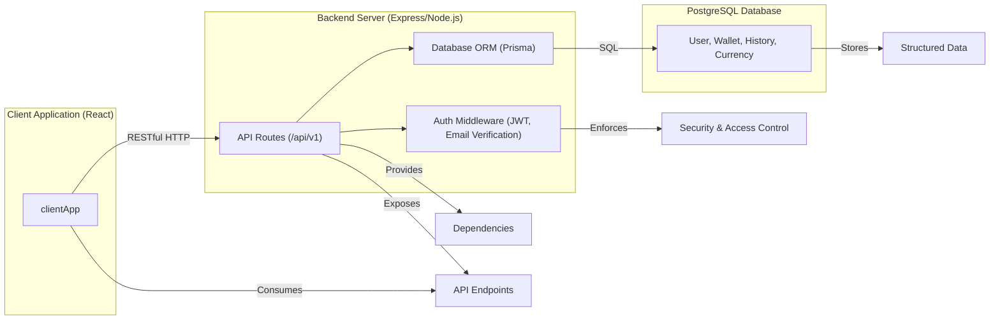

# System Architecture

## Overview
The Shelfya architecture is a modular web application designed for cryptocurrency wallet management, portfolio tracking, and user authentication. It consists of a **React client application** and an **Express backend server**. The backend exposes a RESTful API and integrates with a PostgreSQL database via Prisma ORM, ensuring secure storage and retrieval of user, wallet, and transactional data. The system enables authenticated user sessions, wallet portfolio insights, email verification workflows, and historical tracking of asset values.

## Key Features

- **User Authentication & Authorization**:  
  Secure registration, login, and JWT-based session management with access and refresh tokens. Email verification supports account activation.

- **Wallet Management**:  
  Users can link, view, and manage multiple cryptocurrency wallets. Wallet records are securely associated with user profiles.

- **Portfolio Tracking & Analytics**:  
  The backend aggregates holdings and value history for each wallet and provides endpoints for retrieving portfolio performance data over time.

- **Historical Data Recording**:  
  The system maintains structured, timestamped records of asset values and portfolio changes to facilitate analytics and reporting.

- **RESTful API with Role-Based Access**:  
  APIs for authentication, wallet access, profile management, and portfolio analytics. Access control is enforced using JWT and middleware.

- **Environment & Security Controls**:  
  System health depends on required environment variables. Security best practices include helmet, CORS, request rate limiting, and parameter validation.

## System Errors

- **Invalid or Missing JWT Token**:  
  API requests requiring authentication fail with 401 Unauthorized if the JWT is missing, expired, or invalid.  
  *Resolution*: Refresh token, re-authenticate, or check client request headers.

- **Email Not Verified**:  
  Certain actions (e.g., login, profile updates) may require email verification.  
  *Resolution*: Follow the verification link sent to the user’s email.

- **Rate Limit Exceeded**:  
  Too many auth or registration attempts trigger a 429 Too Many Requests error.  
  *Resolution*: Wait for the cooldown period before retrying.

- **Missing Environment Variables**:  
  Application startup fails if any required environment variables are missing.  
  *Resolution*: Set the missing environment variables as outlined in backend/src/constants.ts (`REQUIRED_ENV_VARS`).

## Usage Examples

```tsx
// Client: Logging In and Accessing the Dashboard
// Pseudocode (React + API usage)
function handleLogin(email, password) {
  fetch(`${process.env.API_URL}/api/v1/auth/login`, {
    method: 'POST',
    credentials: 'include',
    body: JSON.stringify({ email, password }),
    headers: { 'Content-Type': 'application/json', }
  }).then(res => {
    if (res.ok) navigate('/dashboard');
    else alert('Authentication failed');
  });
}

// Client: Fetching Wallet Portfolio (after auth)
fetch(`${process.env.API_URL}/api/v1/portfolio`, {
  method: 'GET',
  credentials: 'include',
  headers: {
    Authorization: `Bearer ${accessToken}`
  }
}).then(resp => resp.json()).then(data => setPortfolio(data));

// Backend: Adding an authenticated API route
router.use('/wallet', verifyAccessToken, walletRouter);
```

## System Integration


