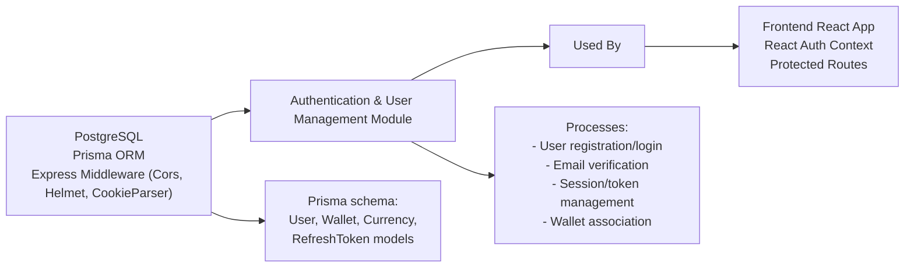

# Authentication & User Management

## Overview
This module enables authentication, user management, and secure session handling for the Shelfya application. It provides the foundational capabilities for user registration, login, email verification, role assignment, and wallet linking. It ensures only authorized users can access protected resources and integrates with both backend (Express API, Prisma ORM) and frontend (React Auth context).

## Key Features

- **User Registration & Login**: Allows users to sign up and sign in using email and password with secure credential storage and validation.
- **Email Verification**: Tracks email verification status, allowing restricted feature access until verification.
- **Role Management**: Supports role-based access via user roles (`ADMIN` and `USER`) for authorization.
- **Session Management (Refresh Token)**: Implements refresh token workflow using a persistent, expirable token for authenticated sessions.
- **Wallet Association**: Enables users to link multiple crypto wallets, each with unique addresses and history tracking.
- **Protected Routing (Frontend)**: Ensures React components and pages requiring authentication cannot be accessed by unauthenticated users.
- **API Integration**: Exposes REST endpoints (`/auth/login`, `/auth/logout`, etc.) consumed by the client application.

## System Errors

- **Invalid Credentials**: Returned when login email or password is incorrect.
  - *Resolution*: Ensure the email and password match what's registered.
- **Unverified Email**: Raised if a user attempts login before verifying their email address.
  - *Resolution*: Complete email verification via the link sent after registration.
- **Token Expired/Invalid**: Occurs if refresh/access tokens are missing, expired, or malformed.
  - *Resolution*: Re-authenticate to obtain fresh tokens and check system time sync.
- **Unauthorized Access**: Triggered when attempting to access protected routes or APIs without valid credentials.
  - *Resolution*: Ensure user is logged in and token exists in localStorage or cookies.
- **Duplicate Wallet Address**: Adding a wallet address already linked to another user or account is not allowed.
  - *Resolution*: Use only unique wallet addresses per user.

## Usage Examples

```tsx
// Client-side React: Logging in and protecting a route

import { useAuth } from "./hooks/useAuth";

// In a Login component
const { login } = useAuth();
await login("user@email.com", "password"); // Sets token, authenticates user

// In a Protected component
import ProtectedRoute from "./components/ProtectedRoute";
<Route
  path="/dashboard"
  element={
    <ProtectedRoute>
      <Dashboard />
    </ProtectedRoute>
  }
/>
```

```ts
// Backend Express.js routes (sample API usage)

POST /api/v1/auth/login   // Login, returns access/refresh tokens
POST /api/v1/auth/logout  // Logout, invalidates session

// On registration: 
// POST /api/v1/auth/register (initiates email verification flow)

// Prisma schema: User linked to Wallet(s)
model User {
  ...
  wallets         Wallet[]
  isEmailVerified Boolean @default(false)
  refreshToken    RefreshToken[]
}

model RefreshToken {
  ...
  userId    Int
  expiresAt DateTime
}
```

## System Integration


