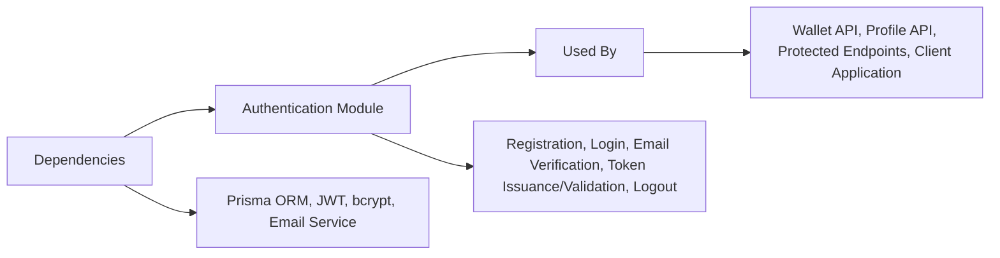

# Authentication Module

## Overview
The Authentication Module is responsible for managing user identity and access within the system. It provides secure registration, login, email verification, token management, and access control, forming the foundation for user session and authorization workflows. This module ensures that only registered and verified users can access protected resources, using robust security practices such as JWTs, refresh tokens, and secure password management.

## Key Features
- **User Registration**: Allows new users to sign up by providing their email, password, and name. Automatically triggers email verification workflows.
- **User Login**: Authenticates users using their email and password, issues an access token (JWT) and a secure refresh token for session management.
- **Email Verification**: Confirms a user's email address via a verification token sent by email, enabling full access after confirmation.
- **Token Refresh**: Issues new access tokens via stored refresh tokens, supporting persistent sessions without repeated logins.
- **Logout**: Invalidates the current user's refresh token, effectively ending user sessions.
- **Access Token Validation Middleware**: Enforces secure access to API endpoints by verifying JWTs in request headers.

## System Errors
- **Registration Errors**: 
  - *Email already registered*: Returned when attempting to register an email that already exists.  
    **Resolution**: Use a different email or proceed to login if account exists.
  - *Password validation failed*: Input password does not meet required complexity.  
    **Resolution**: Ensure password is at least 8 characters and meets complexity requirements (uppercase, lowercase, number, special character).
- **Login Errors**:
  - *Invalid password or email*: User credentials are incorrect, or email is unverified.
    **Resolution**: Verify credentials are correct and email has been verified.
- **Token Errors**:
  - *Refresh token is required/invalid*: No refresh token provided, or token is incorrect or expired.
    **Resolution**: Ensure a valid refresh token cookie is present and not expired.
  - *Access token invalid/expired*: Access token is missing, malformed, or expired when accessing protected APIs.
    **Resolution**: Obtain a new access token via refresh route, or re-login.
- **Email Verification Errors**:
  - *Failed to verify email*: Invalid or expired verification token used.
    **Resolution**: Request a new verification email or ensure using the latest received link.

## Usage Examples
```typescript
// Register a new user
POST /api/v1/auth/register
{
  "name": "Jane Doe",
  "email": "jane@example.com",
  "password": "Str0ngP@ss!"
}

// Login
POST /api/v1/auth/login
{
  "email": "jane@example.com",
  "password": "Str0ngP@ss!"
}
// Response: { "accessToken": "<jwt>", ... }, cookie 'refreshToken'

// Verify Email
GET /api/v1/auth/verify-email/<token-from-email>

// Refresh Access Token (requires refreshToken cookie)
POST /api/v1/auth/refresh-access-token
// Response: { "accessToken": "<jwt>" }

// Logout (clears refresh token cookie)
POST /api/v1/auth/logout
```

## System Integration

