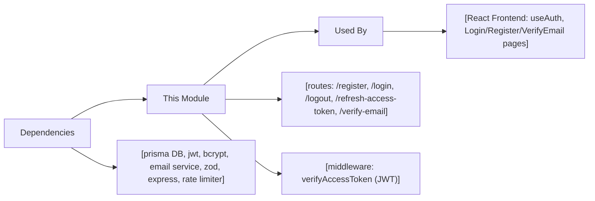

# Authentication Module

## Overview
The Authentication Module manages user identity within the system, handling user registration, login, logout, token management, and email verification. It secures API endpoints through JWT-based session flows and facilitates safe, easy integration for both backend and frontend components.

## Key Features

- **User Registration**: Allows new users to create an account with email, password, and name. Initiates email verification.
- **Email Verification**: Ensures a valid email before granting access, sending verification links post-registration.
- **User Login**: Enables registered, verified users to authenticate with email and password, receiving JWT tokens for session management.
- **Access & Refresh Token Management**: Issues short-lived access tokens for API access and long-lived refresh tokens (stored in cookies) to maintain sessions securely.
- **Session Refresh**: Provides a mechanism to exchange refresh tokens for new access tokens without a full re-login, improving UX and security.
- **Logout**: Invalidates refresh tokens, clears them from cookies and the database, and ensures user sessions are closed securely.
- **Protected Routes Middleware**: Supplies Express middleware to protect backend endpoints by requiring valid JWTs in API requests.
- **Rate Limiting**: Safeguards login and registration endpoints with configurable rate-limiting middleware to prevent abuse.
- **Frontend Integration Hooks**: Offers React hooks (`useAuth`) and component examples (Login, Register, VerifyEmail) to streamline authentication into user-facing applications.

## System Errors

- **Invalid Credentials**: Occurs when login is attempted with incorrect email or password.  
  **Resolution**: Ensure correct details; check for typos or verify account registration.
- **Unverified Email**: Login is blocked if a user has not completed email verification.  
  **Resolution**: Users must verify their email via the link sent post-registration.
- **Email Already Registered**: Attempting to register with an existing email triggers this error.  
  **Resolution**: Use another email or recover the previous account.
- **Invalid/Expired Token**: Refresh, access, or email verification tokens may become invalid or expire.  
  **Resolution**: Re-login or request a new verification email.
- **Token Required**: Attempting actions needing tokens (e.g., logout, refresh) without sending a proper token, typically in cookies.  
  **Resolution**: Ensure authentication flow sets and sends required cookies/tokens.
- **Rate Limit Exceeded**: Too many login or registration attempts in a short period trigger this error.  
  **Resolution**: Wait before retrying; ensure form is not being re-submitted rapidly.

## Usage Examples

```typescript
// Backend: Express route usage
import { authRouter } from './routes/auth';
app.use('/auth', authRouter);

// Frontend: React useAuth hook for login
import { useAuth } from '../hooks/useAuth';

const LoginPage = () => {
  const { login } = useAuth();
  login('user@example.com', 'password123');
};

// Frontend: Register user via API
await API.post("/auth/register", {
  email: "newuser@email.com",
  password: "SafeP@ssw0rd!",
  name: "New User"
});

// Verifying email (upon visiting verification link)
await API.get(`/auth/verify-email/${verificationToken}`);

// Refreshing Access Token (handled automatically with cookies, or via API)
await API.post('/auth/refresh-access-token');

// Logging out
const { logout } = useAuth();
logout();
```

## System Integration


