# Authentication Module

## Overview
The Authentication Module provides a secure, token-based authentication system for users and API clients. It manages user registration, login, email verification, access and refresh token issuance, token renewal, and logout processes. This module serves as the entry point for user access and session management for both front-end and back-end interactions.

## Key Features

- **User Registration**: Handles user sign-up, enforces strong password policies, and initiates email verification to activate accounts.
- **Email Verification**: Sends verification emails after registration and validates user accounts upon link activation.
- **User Login**: Authenticates users with email and password, issues access and refresh JWTs, and securely sets the refresh token in HTTP-only cookies.
- **Access Token Refresh**: Allows clients to obtain new access tokens by presenting a valid, non-expired refresh token (using cookie storage).
- **Logout**: Revokes user sessions by deleting refresh tokens both client-side (clearing cookies) and server-side (deletion from database).
- **Access Control Middleware**: Validates access tokens on protected routes to enforce security policies.
- **Rate Limiting**: Applies brute-force protection on registration and login endpoints via API rate limiting.

## System Errors

- **Invalid or Expired Token**: Returned when provided JWTs are malformed, expired, or cannot be verified.  
  *Resolution*: Re-authenticate or request a new token via refresh flow.
- **Email Already Registered**: Attempt to register with an already-used email.  
  *Resolution*: Use the login flow or a different email address.
- **Unverified Email**: Attempt to log in with an account whose email is not verified.  
  *Resolution*: Check inbox for the verification email and complete the process.
- **Invalid Credentials**: Incorrect email or password supplied at login.  
  *Resolution*: Confirm the credentials and try again.
- **Refresh Token Missing or Invalid**: Refresh token not present in cookies or not valid during access token refresh or logout.  
  *Resolution*: Ensure the browser is configured to send cookies and the user is properly logged in.
- **Rate Limiting Triggered**: Too many login or registration attempts in a short time window.  
  *Resolution*: Wait and retry after some time.
- **Unknown Internal Error**: Catch-all for unhandled server faults.  
  *Resolution*: Retry later or contact support.

## Usage Examples

```typescript
// Registration (client-side)
await API.post("/auth/register", {
  email: "user@example.com",
  name: "User Name",
  password: "StrongP@ssw0rd"
});

// After registration, user receives an email verification link.
// User clicks: /auth/verify-email/:token (GET request handled by backend).

// Login (client-side, with useAuth hook)
const { login } = useAuth();
await login("user@example.com", "StrongP@ssw0rd");
// Access token stored in localStorage, refresh token handled via HttpOnly cookie.

// Refreshing access token (client-side example)
const { data } = await API.post("/auth/refresh-access-token", {}, { withCredentials: true });
localStorage.setItem("token", data.accessToken);

// Logout (client-side, with useAuth hook)
const { logout } = useAuth();
await logout();

// Protecting a backend route (Express middleware)
import { verifyAccessToken } from "../middleware/auth";
app.get('/protected', verifyAccessToken, (req, res) => {
  res.json({ secret: "data" });
});
```

## System Integration

```mermaid
flowchart LR
  clientUI["Frontend<br/> (Login, Register, VerifyEmail Pages)"]
  useAuthHook["useAuth<br/>(Auth Context)"]
  apiLayer["API Service (axios calls)"]
  authRouter["Auth API Routes (Express)"]
  authController["Auth Controller"]
  authService["Auth Service"]
  tokenService["Token Service"]
  mailService["Email Service"]
  authMiddleware["Access Control Middleware"]
  db["Database<br/>(Users, Refresh Tokens)"]

  clientUI --> useAuthHook
  useAuthHook --> apiLayer
  apiLayer --> authRouter
  authRouter --> authController
  authController --> authService
  authService --"Registers users, verifies emails"--> mailService
  authService --"Token management"--> tokenService
  tokenService --"Persists Refresh Tokens"--> db
  authService --"Reads/writes users"--> db
  authController --> authMiddleware
  authMiddleware --> authService
  authRouter --"Protect /auth/* routes"--> authMiddleware
```


