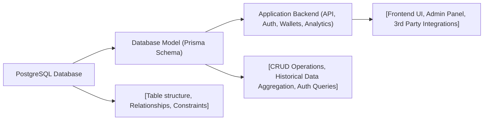

# Database Model

## Overview
The database model defines the persistent data structures for the system, managing users, authentication, wallets, currencies, and their histories. It enables reliable storage and retrieval of application data for core features such as user authentication, wallet management, asset tracking, and historical analytics.

## Key Features
- **User Management**: Stores user credentials, roles (admin/user), email verification status, and associated wallets.
- **Authentication Tokens**: Supports refresh tokens for secure, long-lived authentication sessions tied to specific users.
- **Wallet Management**: Tracks wallets with unique addresses, ownership (user relation), and title metadata.
- **Wallet History Tracking**: Logs time-stamped wallet events, including asset quantities, values, and associated currencies, enabling historical portfolio analysis.
- **Currency Definitions**: Manages supported asset types with unique symbols and names.
- **Currency Price History**: Records daily price history for each currency, supporting features like historic price queries and portfolio valuation over time.
- **Role-Based Access**: Enforces user roles (ADMIN, USER) to support authorization in other system modules.

## System Errors
- **Unique Constraint Violations**: Errors occur when inserting duplicate email (User), token (RefreshToken), or wallet/currency symbol.  
  *Resolution*: Ensure the provided value is unique before creation.
- **Foreign Key Constraint Violations**: Errors when referencing non-existent users, wallets, or currencies in related tables (e.g., assigning a Wallet to a User that does not exist).  
  *Resolution*: Verify references point to existing records.
- **Missing Required Fields**: Errors are triggered if non-nullable fields (such as `WalletHistory.quantity` or `CurrencyHistory.price`) are missing during record creation.  
  *Resolution*: Supply all required fields.

## Usage Examples

```javascript
// Example: Creating a new user with a wallet and logging history using Prisma Client

const user = await prisma.user.create({
  data: {
    email: "alice@example.com",
    password: "securepassword",
    name: "Alice",
    role: "USER",
    wallets: {
      create: {
        address: "0xABC123...",
        title: "Alice's Main Wallet",
        history: {
          create: {
            date: new Date(),
            quantity: 1.5,
            value: 3000,
            currency: {
              connect: { symbol: "BTC" }
            }
          }
        }
      }
    }
  }
});

// Example: Recording historical price for a currency
await prisma.currencyHistory.create({
  data: {
    date: new Date("2024-06-25"),
    price: 50000,
    currency: {
      connect: { symbol: "BTC" }
    }
  }
});

// Example: Creating a refresh token for a user
await prisma.refreshToken.create({
  data: {
    token: "refreshTokenSample",
    userId: user.id,
    expiresAt: new Date(Date.now() + 1000 * 60 * 60 * 24 * 7) // 7 days from now
  }
});
```

## System Integration


