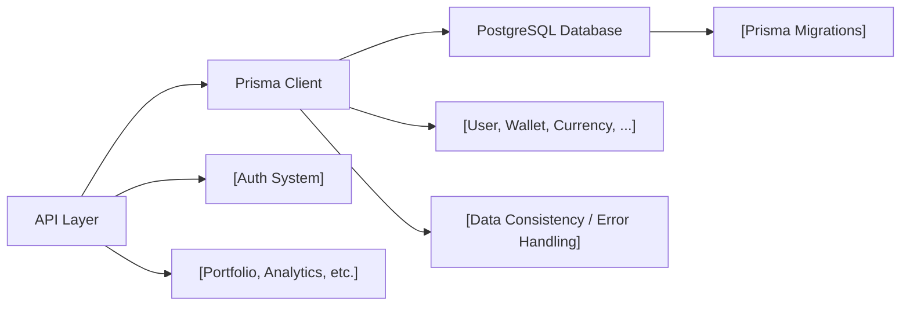

# Database Module

## Overview
The Database Module provides a unified interface for storing, querying, and managing user, wallet, currency, and authentication data within the application. It leverages Prisma as an ORM for PostgreSQL, exposing a well-defined data model that underpins authentication, asset tracking, wallet management, and currency history features.

## Key Features

- **User & Authentication Management**:  
  Manages user accounts, roles (ADMIN, USER), email verification status, and secure refresh tokens for session management.
  
- **Wallet & Wallet History Tracking**:  
  Enables users to own and manage multiple wallets, including assigning unique addresses and titles. It maintains an immutable history of wallet balances and valuations per currency on specific dates.
  
- **Currency Data with Historical Pricing**:  
  Stores recognized currencies (by unique symbol), with optional names, and tracks their price fluctuations over time. The module maintains a comprehensive historical record for analytics and reporting.
  
- **Compositional Data Relationships**:  
  Supports relational queries across users, wallets, currencies, their histories, and authentication tokens, allowing complex queries such as "wallet value over time" and "user's portfolio at a historical point."
  
- **Unique Constraints & Data Consistency**:  
  Enforces uniqueness for key fields like user email, wallet address, currency symbol, and ensures referential integrity throughout the data model.

## System Errors

- **Unique Constraint Violations**:  
  Occur when attempting to create users (duplicate email), wallets (duplicate address), currencies (duplicate symbol), or tokens.  
  _Resolution_: Ensure the uniqueness of these fields before creation. Handle duplicate errors gracefully in the application.

- **Foreign Key Violations**:  
  Operations involving non-existent user, wallet, or currency references will fail.  
  _Resolution_: Validate relational data before insert/update. Confirm referenced entities exist.

- **Required Field Errors**:  
  Inserting items without required fields (e.g., wallet address, currency symbol, wallet title, etc.) will result in a database error.  
  _Resolution_: Validate all required fields are populated before attempts to write to the database.

- **Composite Key Error**:  
  Attempt to insert multiple `CurrencyHistory` entries with the same (date, currencyId) pair triggers a uniqueness violation.  
  _Resolution_: Ensure only one historical entry per currency per date.

## Usage Examples

```typescript
import { prisma } from '../src/lib/prisma';

// Create a new user
const newUser = await prisma.user.create({
  data: {
    name: 'Alice',
    email: 'alice@example.com',
    password: 'hashedpassword',
    role: 'USER'
  }
});

// Create a wallet for the user
const newWallet = await prisma.wallet.create({
  data: {
    address: '0x1234abcd...',
    title: 'Alice\'s Main Wallet',
    userId: newUser.id
  }
});

// Record wallet history (e.g., daily balance)
await prisma.walletHistory.create({
  data: {
    date: new Date('2024-01-15'),
    quantity: 2.5,
    value: 500.0,
    currencyId: 1,   // existing currency id
    walletId: newWallet.id
  }
});

// Add a new currency and record its historical price
const btc = await prisma.currency.create({
  data: { symbol: 'BTC', name: 'Bitcoin' }
});
await prisma.currencyHistory.create({
  data: { price: 40000, date: new Date('2024-01-15'), currencyId: btc.id }
});

// Generate portfolio snapshot by joining wallet, walletHistory, and currencyHistory
const walletSnapshots = await prisma.wallet.findMany({
  where: { userId: newUser.id },
  include: {
    history: {
      include: { currency: true }
    }
  }
});
```

## System Integration



- **API Layer** interacts with the **Prisma Client**, which serves as the entry point for all database operations.
- **Prisma Client** is generated from the **schemaModels** and manages interaction with the **PostgreSQL Database**.
- **Migrations** keep the database schema synchronized as models evolve.
- Both **errorHandling** and **data consistency** are managed through Prisma’s ORM guarantees and the unique/index constraints in the model.
- Broader systems (authentication, analytics, portfolio calculations) depend on this module for fetching and storing structured data.