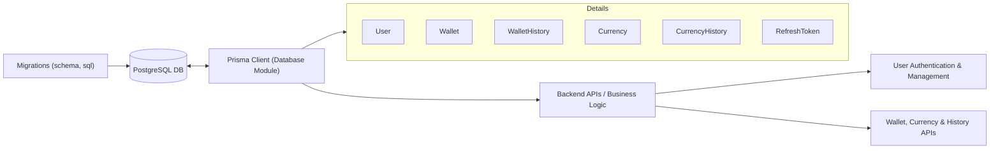

# Database Module

## Overview
The Database module manages all persistent data storage for users, wallets, currencies, and associated histories using PostgreSQL and Prisma ORM. It provides the core data layer for authentication, wallet management, transaction histories, and currency tracking, ensuring data integrity and offering a unified API for CRUD operations required by the Shelfya backend.

## Key Features
- **User and Auth Management**: Handles user registration, authentication, role assignments (ADMIN, USER), email verification status, and refresh token storage for session management.
- **Wallet and History Tracking**: Supports the creation and management of wallets, associating them with users, storing wallet histories (including detailed currency balance snapshots over time).
- **Currency and Price History**: Manages available currencies (with unique symbols) and tracks the changing value of each currency through detailed time series in CurrencyHistory.
- **Data Integrity & Uniqueness**: Enforces unique constraints on key fields (like emails, wallet addresses, currency symbols, and historical records) to prevent conflicts and ensure reliable lookups.
- **Prisma Client API**: Exposes a strongly-typed database API for all models, enabling other backend modules to reliably query and update data.

## System Errors
- **Unique Constraint Violation**: 
  - **Description**: Attempting to insert a user, wallet, currency, or refresh token with a value that already exists in a unique field (like email, wallet address, symbol, or token).
  - **Resolution**: Ensure unique values for each field or handle errors gracefully in upstream code.
- **Foreign Key Constraint Failure**:
  - **Description**: Attempting to reference a non-existent user, wallet, or currency when creating related records (e.g., WalletHistory, CurrencyHistory).
  - **Resolution**: Verify referenced entities exist before attempting insert/update.
- **Required Field Missing**:
  - **Description**: Omitting required fields (e.g. quantity or value in WalletHistory) will cause validation errors.
  - **Resolution**: Provide all non-nullable fields when inserting or updating records.

## Usage Examples

```typescript
// Initializing Prisma Client (singleton pattern recommended)
import { prisma } from "../src/lib/prisma";

// Create a user
const user = await prisma.user.create({
  data: {
    email: "john@example.com",
    password: "hashedpassword",
    role: "USER"
  }
});

// Add a wallet for the user
const wallet = await prisma.wallet.create({
  data: {
    address: "0xDEADBEEF123",
    title: "Main Wallet",
    userId: user.id
  }
});

// Record a wallet's currency balance at a given time
await prisma.walletHistory.create({
  data: {
    date: new Date(),
    quantity: 2.5,
    value: 5000,
    currencyId: 1, // Must correspond to an existing currency
    walletId: wallet.id
  }
});

// Add a new currency and track its price history
const currency = await prisma.currency.create({
  data: {
    symbol: "BTC",
    name: "Bitcoin"
  }
});
await prisma.currencyHistory.create({
  data: {
    date: new Date(),
    price: 50000,
    currencyId: currency.id
  }
});
```

## System Integration


