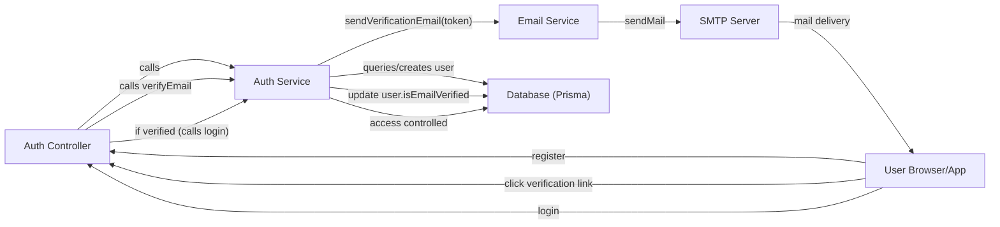

# Email Verification

## Overview
The Email Verification module ensures that users registering for the application own the email address they provide. This feature is fundamental to system security and user onboarding: it prevents fake sign-ups, enables lost-password workflows, and enforces that email communications reach legitimate users.

The module sends a unique verification link to the user's email during registration. Users must activate this link to complete their registration and gain access to authenticated features.

## Key Features

- **Automated Verification Email Delivery**: Sends a secure, time-limited email verification link to users after registration using SMTP.
- **Verification Link Processing**: Processes clicks on verification links, confirming the user's email and updating user status in the database.
- **Registration Workflow Enforcement**: Requires email verification for successful login, ensuring only verified users can access protected resources.
- **Token-based Verification**: Integrates JWT tokens within email links to securely match verification requests with user accounts.

## System Errors

- **Email Already Registered**: Triggered if a new registration attempts to use an email that already exists in the system.  
  *Resolution*: Prompt the user to log in or reset their password.
- **Verification Email Not Sent**: Failure in SMTP/sendMail (e.g., SMTP misconfiguration, network errors).  
  *Resolution*: Check SMTP configuration, review server/network logs, and retry the operation.
- **Invalid or Expired Token**: The email verification link is invalid or the token has expired.  
  *Resolution*: Request a new verification email via the application's resend mechanism.
- **Email Not Verified (on Login)**: User tries to log in before verifying their email.  
  *Resolution*: Prompt the user to verify their email; offer to resend verification.
- **Database/Update Errors**: Issues when updating user verification status.  
  *Resolution*: Check the database connection and integrity, then retry.

## Usage Examples

```typescript
// Registration automatically triggers a verification email:
POST /register
{
  "name": "Jane Doe",
  "email": "jane@example.com",
  "password": "secure-password"
}
// Response: prompts user to check email for verification link

// User receives email with: https://client-app/verify-email/<token>

// User verifies account via:
GET /verify-email/:token
// On success: "Email verified successfully"

// Login fails if email is not verified:
POST /login
{
  "email": "jane@example.com",
  "password": "secure-password"
}
// Response: error indicating email not verified
```

## System Integration


