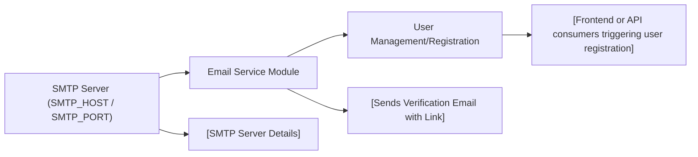

# Email Service

## Overview
The Email Service module provides automated email delivery capabilities, specifically for sending user verification emails within the system. It ensures that users receive account validation instructions via email, facilitating secure onboarding and trust in user identity.

## Key Features
- **Send Verification Email**: Automatically dispatches email messages containing a unique verification link to users registering with the system. This link enables users to confirm their email addresses, supporting security and compliance requirements.

## System Errors
- **Email Delivery Failure**: If the system cannot send emails (e.g., incorrect SMTP configuration, network issues, or email service downtime), it throws an error indicating that verification email delivery failed.  
  **Resolution**: Verify SMTP environment variables (`SMTP_HOST`, `SMTP_PORT`), check network connectivity, and ensure that the external mail service is operational.

- **Invalid Email Address**: Attempting to send emails to addresses that do not exist or are misformatted may cause delivery failure from the mail server.  
  **Resolution**: Ensure the email address being provided is correct and valid.

## Usage Examples

```typescript
import { EmailService } from './services/email.service';

const emailService = new EmailService();

const userEmail = "user@example.com";
const verificationToken = "unique-verification-token";

emailService.sendVerificationEmail(userEmail, verificationToken)
  .then(() => {
    console.log("Verification email sent successfully.");
  })
  .catch((error) => {
    console.error("Failed to send verification email:", error);
  });
```

## System Integration


