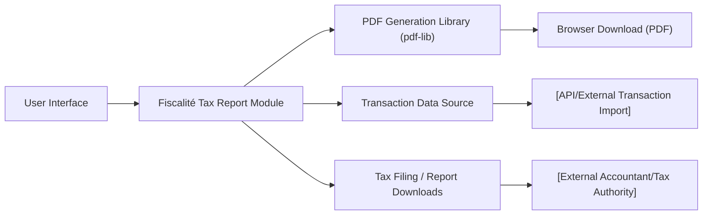

# Fiscalité Tax Report Module

## Overview
The Fiscalité Tax Report module enables users to view, calculate, and generate official reports for crypto capital gains (plus-values) taxation, based on their account transaction history. It provides a user interface to audit all relevant deposit and withdrawal transactions, computes taxable gains according to standard formulas, and exports the tax report as a structured PDF document for regulatory or accounting needs.

## Key Features
- **Transaction Audit Table**: Displays all relevant crypto deposit and withdrawal operations, including amounts, prices, fees, and capital gains per transaction.
- **Capital Gain Calculation**: Automatically computes individual and total taxable gains from transaction history, following French fiscality rules.
- **PDF Tax Report Generation**: Creates and downloads a PDF summarizing all transactions and capital gain computations; suitable for regulatory filing or accountant review.
- **Visual Calculation & Summary**: Presents the summary of total gains and taxable amount (30% tax rate) in the interface, providing transparency before report export.

## System Errors
- **PDF Generation Failed**: PDF may not be generated if the browser blocks popups or if PDF libraries fail to load.
  - *Resolution*: Ensure popups are permitted and the environment supports the required features. Try reloading the application.
- **Transaction Data Missing**: If no transactions are available, the report will be empty and calculations incorrect.
  - *Resolution*: Ensure transaction sync/computation is complete before generating the report.
- **Date Format Issues**: Inconsistent date displays if locale (browser) is not supported.
  - *Resolution*: Use a supported browser locale or update application i18n settings.

## Usage Examples

```jsx
import Fiscalite from 'path/to/Fiscalite';

// In your React page/component:
<Fiscalite />

// On screen: 
// - Users see a table of crypto transactions, capital gain calculations, total gain, and taxable amount.
// - Clicking 'Générer le PDF' generates a downloadable report file in PDF format with all details.
```

## System Integration


