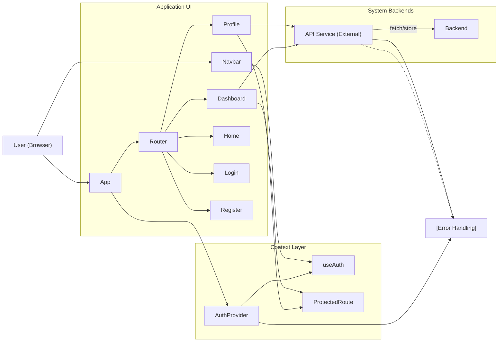

# Frontend Architecture

## Overview
The frontend architecture serves as the main user interface for the Shelfya application, handling user authentication, navigation, wallet management, and the display of portfolio analytics. Built with React and React Router, it ensures authenticated access to key application features, allows users to manage their crypto wallet connections, and visualizes crypto portfolio values and historical data through interactive components. The system is structured around modular pages and shared components, orchestrated via application-wide context for authentication and navigation.

## Key Features

- **User Authentication Context (`useAuth`)**:
  Manages authentication state across the application, allowing users to log in, log out, and maintain session state. Provides authenticated access to protected pages (e.g., Dashboard, Profile).

- **Navigation Bar (`Navbar`)**:
  Responds to authentication status to surface appropriate navigation options (Dashboard, Profile, Login, Register, Logout). Centralizes navigation and user actions.

- **Protected Routing**:
  Enforces route access control to sensitive features like Dashboard and Profile, ensuring only authenticated users can access them.

- **Dashboard Page**:
  Visualizes the user's crypto portfolio, provides time-range-based historical value charts, wallet selector, and portfolio overview (allocation, daily change, value variation). Fetches data from API endpoints and dynamically updates views.

- **Profile Page**:
  Allows users to view and update their profile data (name, email, password) and manage (add, remove) linked crypto wallets. Integrates error and success feedback mechanisms for each action.

- **Wallet Management**:
  Enables users to add new wallets by title and address, view connected wallets, and delete existing wallets. Interacts directly with backend APIs to persist wallet changes.

- **Responsive UI**:
  Uses modern UI libraries (e.g., recharts for graphs, react-select for wallet selection) and Tailwind CSS for a consistent and adaptive experience.

## System Errors

- **Authentication Error**:
  - Description: Failed login due to invalid credentials, token expiration, or session termination.
  - Resolution: Ensure correct email/password or log in again. If persistent, check backend authentication status.

- **API Fetch Error**:
  - Description: Failure to fetch wallet, profile, or historical data. Presented as "Failed to fetch data" or "Erreur lors de la récupération des wallets/profil".
  - Resolution: Check network connectivity. Retry after a moment. If persistent, backend service may need attention.

- **Wallet Operation Error**:
  - Description: Errors adding or deleting wallet, such as "Erreur lors de la création du wallet" or "Erreur lors de la suppression du wallet".
  - Resolution: Ensure address and title are valid. Retry operation; if still fails, examine backend logs.

- **Password Update Error**:
  - Description: Password update failed, e.g., "Passwords do not match" or "Password update failed."
  - Resolution: Confirm passwords match and conform to security requirements. Follow any in-app error message for specifics.

- **No Wallets Connected**:
  - Description: Profile page shows "No wallet connected".
  - Resolution: Use the form to add a wallet.

## Usage Examples

```jsx
// Authenticate and load app context
import React from "react";
import App from "./App";
import { AuthProvider } from "./hooks/useAuth";

export default function Root() {
  return (
    <AuthProvider>
      <App />
    </AuthProvider>
  );
}

// Logging in a user (inside a form submit handler)
const { login } = useAuth();
await login(email, password); // sets auth context and persists token

// Accessing Dashboard and switching wallets
<Dashboard /> // automatically fetches wallets; users can select a wallet from the dropdown

// Managing wallets on Profile page
<Profile /> // enables adding/deleting wallets and updating profile information

// Navigation adapts to authentication status
<Navbar /> // shows Dashboard/Profile/Logout when authenticated, Login/Register otherwise
```

## System Integration



**Legend:**
- **UI pages [Application UI]:** Entry points for user-facing workflows.
- **Context Layer:** Provides global state (authentication) and route protection.
- **System Backends:** All data is fetched/persisted via API service calls to the backend.
- **Error Handling:** Errors are surfaced to the UI with user-friendly descriptions and resolutions.