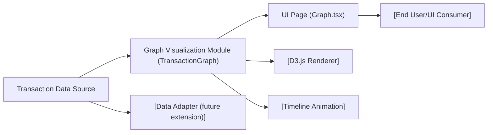

# Graph Visualization

## Overview
The Graph Visualization module provides users with an interactive and dynamic visualization of transaction flows within the application. It renders transaction data as a node-link (force-directed) graph, allowing users to visually explore relationships between a main wallet and a series of transactions over time. The visualization animates the progression of transactions, highlighting how the transaction network evolves with each passing day.

## Key Features

- **Dynamic Transaction Graph**: Visualizes wallets and transactions as nodes and edges, showing the flow of value between the main wallet and its connected transactions.
- **Timeline Animation**: Animates the graph over a timeline, revealing how new transactions are added each day and updating the graph layout accordingly.
- **Interactive Tooltips**: Displays contextual information (wallet ID, transaction value) when users hover over individual nodes in the graph.
- **Responsive Progress Bar**: Shows current point-in-time during the animation, helping users track the progression of the graph over the selected period.
- **Seamless Integration with D3**: Leverages D3.js for rich, performant SVG rendering and force-directed layout simulations.
- **Encapsulated React Component**: Provides a self-contained React component (`<TransactionGraph />`) suitable for embedding in any React application page.

## System Errors

- **Rendering Failure**: If the graph does not appear, it's likely due to missing or malformed transaction data, or library (D3.js) issues.
  - **Resolution**: Ensure transaction data is provided in the correct format (arrays of nodes and links). Verify that D3.js is properly installed.
- **Timeline Animation Stuck**: If the timeline bar does not progress or graph stops animating.
  - **Resolution**: Check the browser console for JavaScript errors; ensure the component is not unmounted or rendering blocked by parent layout.
- **Tooltips Not Displayed**: If hovering on nodes does not show tooltips or they are misplaced.
  - **Resolution**: Verify that CSS for tooltips is not overridden, and check browser compatibility with absolute and pointer-events styles.

## Usage Examples

```jsx
// Import the TransactionGraph component
import TransactionGraph from '../components/TransactionGraph';

// Use it in a page or any React component
function MyPage() {
  return (
    <div style={{ minHeight: '680px', padding: '2rem', background: '#fff' }}>
      <h1>Visualisation des transactions</h1>
      <TransactionGraph />
    </div>
  );
}
```

## System Integration



- **dataSource**: Source of node/link transaction data (currently, a sample in-component dataset, but designed for back-end or API integration).
- **transactionGraph**: The core visualization logic, implemented as a reusable React component.
- **d3**: Handles force-directed simulation and SVG rendering for the transaction graph.
- **animation**: Manages timeline-based graph evolution and progress UI.
- **uiPage**: The UI-level page that renders `<TransactionGraph />` for end-user consumption.
- **user**: Interacts with the page, views, and explores animated transaction data.

**Note**: For integration with real data sources, provide a data adapter or pass actual data via props to `<TransactionGraph />`. The module is designed to be extensible for different data backends and larger transactional datasets.