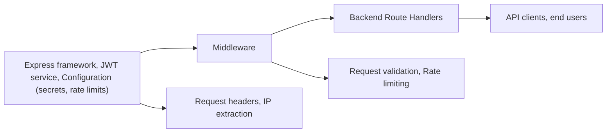

# Middleware

## Overview
The Middleware module provides essential security and request management features for the backend system. It focuses primarily on authentication (verifying access tokens) and rate limiting (controlling the number of requests per IP). These middleware components are inserted into the Express application pipeline to enforce user authentication and protect endpoints from abuse or brute-force attacks.

## Key Features

- **Access Token Verification**: Ensures that incoming requests are authenticated by validating JWT bearer tokens. Requests without a valid access token are rejected with appropriate HTTP status codes.
- **Login Rate Limiting**: Limits the number of login attempts from a single IP address within a preset time window, helping to prevent brute-force attacks on user credentials.
- **Register Rate Limiting**: Restricts the number of registration attempts from a single IP address in a given timeframe, mitigating spam and scripted registrations.

## System Errors

- **Unauthorized Access**: Returned when a request either lacks an Authorization header or the header is malformed (does not start with "Bearer").  
  **Resolution**: Ensure the request includes a properly formatted Authorization header with a valid JWT.

- **Invalid Token**: Returned when the provided JWT cannot be verified or does not match the expected schema.  
  **Resolution**: Obtain and use a valid, non-expired JWT generated by the authentication system.

- **Too Many Requests**: Triggered when the maximum number of allowed requests (login or registration) is exceeded from a single IP within the defined window.  
  **Resolution**: Wait for the window (e.g., 15 minutes) to elapse before retrying. If this happens unintentionally, review any automated scripts or clients making repeated requests.

## Usage Examples

```typescript
// Import middleware into your Express application
import express from "express";
import { verifyAccessToken } from "./middleware/auth";
import { loginLimiter, registerLimiter } from "./middleware/rate-limiter";

const app = express();

// Apply login rate limit middleware to the login route
app.post("/login", loginLimiter, (req, res) => {
  // handle login
});

// Apply register rate limit middleware to the registration route
app.post("/register", registerLimiter, (req, res) => {
  // handle registration
});

// Protect routes with access token verification
app.get("/profile", verifyAccessToken, (req, res) => {
  // Only accessible if JWT access token is valid
});
```

## System Integration


