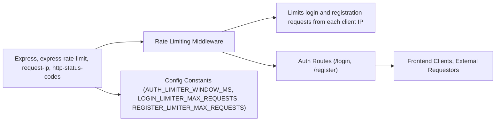

# Rate Limiting Middleware

## Overview
The Rate Limiting Middleware module enforces request rate limits on critical authentication endpoints within the backend API, specifically targeting login and user registration routes. Its purpose is to protect the system from brute-force attacks and abuse by limiting the number of allowed requests from each client IP address within a configurable time window.

## Key Features
- **Login Rate Limiting**: Restricts each client IP address to a limited number of login requests (default: 5) per 15-minute window, reducing the risk of brute-force attacks on user credentials.
- **Registration Rate Limiting**: Restricts each client IP address to a limited number of registration attempts (default: 3) per 15-minute window, preventing automated account creation and abuse.
- **Custom Error Messaging**: Responds with a clear and user-friendly message indicating when the rate limit has been reached and how long to wait before retrying.
- **Client IP Awareness**: Uses the originating client's IP address as the key to track request limits, ensuring rate limiting works behind proxies or load balancers.

## System Errors
- **Rate Limit Exceeded**: 
  - **Description**: The client has sent more requests than allowed within the configured window (e.g., more than 5 logins or 3 registrations within 15 minutes).
  - **Resolution**: The client must wait until the 15-minute window passes before sending more authentication requests. A message like `Too many requests from this IP, please try again after 15 minutes` is returned with HTTP status code 429.
- **Unable to Determine Client IP**:
  - **Description**: If the middleware cannot determine the client's IP address, it treats the key as an empty string, which may unintentionally group requests. 
  - **Resolution**: Ensure deployment environments forward the correct client IP headers (commonly via proxies) for accurate limiting.

## Usage Examples

```javascript
// Import the middleware
const { loginLimiter, registerLimiter } = require('./middleware/rate-limiter');

// Use the rate limiter on authentication routes
app.post('/login', loginLimiter, (req, res) => {
  // login logic here
});

app.post('/register', registerLimiter, (req, res) => {
  // registration logic here
});
```

## System Integration


