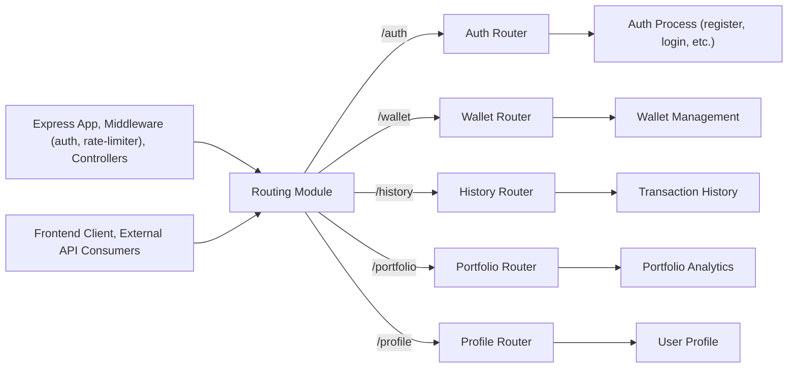

# Routing Module

## Overview
The Routing module serves as the central entry point for API route definitions in the application. It organizes, secures, and exposes endpoints for authentication, wallet management, transaction history, portfolio analytics, and user profile management. This module ensures that each functional area of the wallet tracker is accessible through a consistent, versioned API path structure.

## Key Features
- **Modular Route Organization**: Groups related API endpoints (auth, wallet, history, profile, portfolio) into dedicated routers for maintainability and clarity.
- **Route Prefixing & Namespacing**: All API endpoints are accessible under a common prefix (`/api/v1`), establishing a clear boundary and versioning for backend services.
- **Access Control**: Applies access token verification middleware to protect sensitive routes, ensuring that wallet, history, and profile operations require authentication.
- **Integration-ready Routers**: Exposes individual routers for easy integration with new features or expansion of existing endpoints without affecting the routing logic.
- **Middleware Support**: Integrates with supporting middleware (e.g., rate limiting, authentication) to enhance security and resilience across different API domains.

## System Errors
- **401 Unauthorized**: Returned when a user tries to access protected routes (wallet, history, profile) without a valid or present access token.  
  _Resolution_: Ensure a valid JWT access token is included in the request headers.
- **404 Not Found**: Returned when an endpoint or resource (e.g., wallet by id) does not exist.  
  _Resolution_: Verify the correctness of the URL and resource identifiers.
- **429 Too Many Requests**: Invoked by rate limiters during login and registration if too many requests are sent in a short period.  
  _Resolution_: Wait before retrying or reduce request frequency.

## Usage Examples

```typescript
// Import the main router into your Express server
import express from "express";
import { router as apiRouter } from "./backend/src/routes/index";

const app = express();

app.use("/api/v1", apiRouter);

// Example: Client sends a POST request to register an account
// POST /api/v1/auth/register
// Body: { "email": "...", "password": "..." }

// Example: Client requests their profile (with a valid JWT)
// GET /api/v1/profile
// Headers: Authorization: Bearer <access_token>

// Example: Creating a new wallet (authenticated)
// POST /api/v1/wallet
// Body: { /* wallet creation data */ }
```

## System Integration


