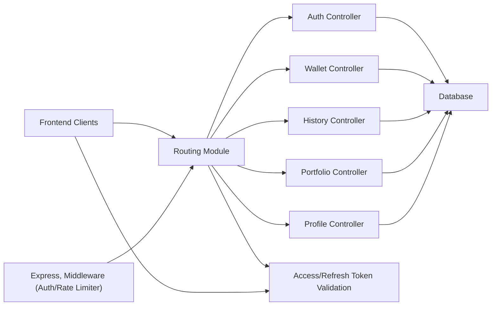

# Routing Module

## Overview
The Routing module manages all public HTTP API endpoints for the backend and coordinates which controllers handle specific system features. It centralizes authentication, wallet management, portfolio tracking, transaction history, and user profile access under a single router, facilitating secure and organized communication between frontend clients and backend services. The routing system also enforces authentication and rate limiting on relevant routes to maintain system security and reliability.

## Key Features

- **User Authentication Endpoints**: Provides registration, login, email verification, token refresh, and logout routes.
- **Wallet Management**: Allows clients to create, list, and delete wallets, protected with authentication middleware.
- **Portfolio Retrieval**: Enables fetching portfolio details by wallet, giving insight into user's asset information.
- **Transaction History**: Permits users to access historical data (price/value evolution) for their selected wallet, secured by authentication.
- **Profile Management**: Lets users view and update profile and password information via authenticated endpoints.
- **Route Protection and Rate Limiting**: Integrates middleware for access token verification and throttling to prevent abuse and secure sensitive operations.
- **Modular Router Structure**: Combines domain-specific sub-routers to ensure scalability and clear code separation.

## System Errors

- **401 Unauthorized**: Returned when endpoints requiring authentication are accessed without a valid access token.
  - *Resolution*: Ensure the Authorization header is set with a valid JWT. Log in again if necessary.
- **429 Too Many Requests**: Triggered by hitting rate-limited endpoints (e.g., login/register) too frequently.
  - *Resolution*: Wait before retrying, or ensure automation/scripts respect rate limits.
- **404 Not Found**: When accessing endpoints with incorrect route or resource identifiers.
  - *Resolution*: Ensure routes and resource IDs (such as wallet or user IDs) are valid.
- **400 Bad Request**: Caused by invalid input parameters or payloads.
  - *Resolution*: Follow API input documentation and use correct types and data formats.

## Usage Examples

```typescript
// Login
await api.post("/auth/login", { email: "user@email.com", password: "pass123" });

// Register
await api.post("/auth/register", { email: "...", password: "...", ... });

// Fetch user's wallets (requires authentication)
await api.get("/wallet", { headers: { Authorization: `Bearer <token>` } });

// Get wallet history (requires authentication)
await api.get("/history/42?startDate=2024-01-01T00:00:00.000Z", { headers: { Authorization: `Bearer <token>` } });

// Get portfolio for wallet
await api.get("/portfolio/42");

// Update user profile (requires authentication)
await api.patch("/profile", { name: "NewName" }, { headers: { Authorization: `Bearer <token>` } });
```

## System Integration


