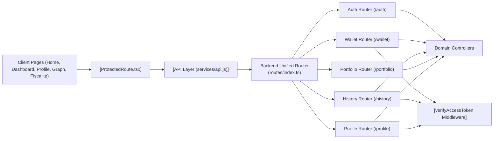

# Routing System

## Overview
The Routing System orchestrates how client and backend modules communicate by structuring, protecting, and exposing the primary API endpoints crucial for authentication, wallet, portfolio, history, and user profile functionalities. On the backend, it defines API routes, secures resources via authentication middleware, and organizes controllers. On the frontend, it coordinates page routing and route protection to enforce user access policies.

## Key Features

- **Backend Unified Router**: Central router (`backend/src/routes/index.ts`) aggregating all domain-specific sub-routers (auth, wallet, history, portfolio, profile) to present a cohesive API to clients.
- **Route-based Access Control**: Implements authentication checks (e.g., `verifyAccessToken`) to restrict access for sensitive routes, ensuring only authenticated users can access and modify user-specific resources.
- **Domain-Specific Endpoints**: Exposes logical endpoints for core operations:
  - `/auth`: User authentication (login, registration, token refresh, email verification, logout).
  - `/wallet`: CRUD operations for wallets (protected).
  - `/history`: Historical portfolio/wallet data access (protected).
  - `/portfolio`: Portfolio value retrieval.
  - `/profile`: User profile management, password changes (protected).
- **Frontend Route Protection**: Client-side component (`ProtectedRoute`) wraps sensitive pages (like Dashboard, Profile, Graph, Fiscalité) to prevent unauthorized viewing, redirecting unauthenticated users to the login screen.
- **Seamless Page Navigation**: Client pages (e.g., Home, Dashboard, Profile, Graph, Fiscalite) are mapped to routes, with smooth transitions and context-aware navigation for both authenticated and unauthenticated flows.

## System Errors

- **401 Unauthorized**: Triggered when accessing protected API routes (`/wallet`, `/history`, `/profile`) without a valid access token.  
  _Resolution_: Authenticate the user and ensure a valid access token is presented.
- **403 Forbidden**: Returned when a valid user attempts to access or modify a resource they do not own.
  _Resolution_: Confirm the user has permission for the resource; cross-check user IDs and resource ownership.
- **429 Too Many Requests**: For `/auth/login` and `/auth/register`, rate limiting middleware prevents brute-force attacks.
  _Resolution_: Wait before retrying or reduce request frequency.
- **Validation Errors**: When client payloads are missing required fields or have invalid formats (applies across modules).
  _Resolution_: Review request body for completeness and correct types.

## Usage Examples

```javascript
// Client: Accessing protected dashboard route (frontend uses ProtectedRoute)
import ProtectedRoute from 'components/ProtectedRoute';
import Dashboard from 'pages/Dashboard';

<Route path="/dashboard" element={
  <ProtectedRoute>
    <Dashboard />
  </ProtectedRoute>
} />

// Backend: Making an authenticated request to fetch all wallets
GET /wallet
Headers: Authorization: Bearer <user-access-token>

// Backend: Logging in
POST /auth/login
Body: { "email": "...", "password": "..." }

// Backend: Fetching portfolio data for a specific wallet
GET /portfolio/:id

// Backend: Updating user's profile (protected)
PATCH /profile
Headers: Authorization: Bearer <user-access-token>
Body: { "name": "...", "email": "..." }
```

## System Integration


