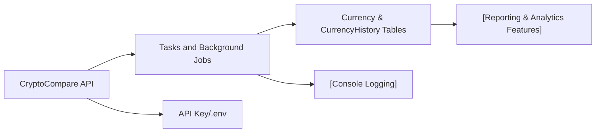

# Tasks and Background Jobs

## Overview
This module provides automated routines for populating and cleaning the application's database with historical cryptocurrency price data. It interacts with external APIs and manages historical records, ensuring that up-to-date and consistent currency history is available for system features reliant on past crypto prices.

## Key Features
- **Currency History Clean-up**: Clears all records from the currency history table, ensuring no stale or duplicated data remains prior to a new data seeding operation.
- **Automated Data Seeding**: Fetches and stores extensive historical daily price data for a configured cryptocurrency (e.g., ETH) in a target currency (e.g., EUR) by integrating with external APIs (CryptoCompare).
- **Idempotent Upserts**: Ensures each date-currency pair in the database is either created or updated, maintaining data consistency and preventing duplication.
- **External API Integration**: Automatically interfaces with the CryptoCompare API to retrieve historical data for supported currency symbols.
- **Logging & Progress Reporting**: Outputs detailed logs during operations for visibility into the data fetching and storage processes.

## System Errors
- **API Connectivity Failure**: Occurs when the system cannot reach or communicate with the external CryptoCompare API.  
  _Resolution_: Ensure network connectivity and a valid API key in environment settings.
- **Data Integrity Warning**: Triggered when an entry fetched from the external API is missing required attributes (date or price).  
  _Resolution_: Such entries are skipped; generally requires no action but may warrant checking API data quality.
- **Database Operation Error**: Encountered if upsert or delete operations fail while accessing the currency or currency history tables.  
  _Resolution_: Check database connection, schema alignment, and logs for more detailed error messages.

## Usage Examples

```ts
// To refresh all ETH/EUR currency history:
await cleanCurrencyHistory(); // Wipes all historical currency data
await populateDb("ETH", "EUR"); // Populates with fresh data from CryptoCompare

// To fetch and store Bitcoin prices in USD:
await cleanCurrencyHistory();
await populateDb("BTC", "USD");
```

## System Integration


