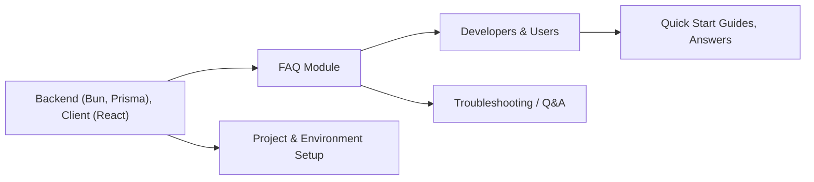

# FAQ Module

## Overview
The FAQ module provides end-users and developers with clear answers to common questions about the client and backend systems. Its purpose is to centralize knowledge, streamline onboarding, and resolve frequent doubts related to project setup, usage, and troubleshooting for both frontend (React client) and backend (Bun/Prisma) environments.

## Key Features
- **Centralized Q&A**: Maintains a curated list of frequently asked questions to accelerate problem-solving and user education.
- **Project Setup Guidance**: Offers step-by-step recommendations for initializing, running, and developing both backend and frontend subsystems.
- **Troubleshooting Repository**: Documents common errors and their resolutions, decreasing support needs and development friction.
- **Context-Sensitive Answers**: Adapts responses to both backend (Bun/Prisma) and frontend (React) aspects of the monorepo.

## System Errors
- **Dependency Installation Issues**:  
  *Description*: Project fails to start due to missing or improperly installed dependencies.  
  *Resolution*: Ensure you run `bun i` in the backend directory, and `npm install` in the client directory.
- **Port Conflicts or Application Not Starting**:  
  *Description*: App fails to run because the default ports are in use or misconfigured.  
  *Resolution*: Make sure no other process uses the default ports (e.g., 3000 for React, backend default for Bun). Change port configurations if necessary.
- **Prisma Client Errors**:  
  *Description*: Errors occur during database operations or startup due to missing or outdated Prisma client files.  
  *Resolution*: Run `bunx prisma generate` after changing the schema, and ensure the database connection is valid.
- **Build/Script Errors in Client**:  
  *Description*: Errors while building or running React scripts (e.g., missing environment variables, linting errors).  
  *Resolution*: Review the console output, confirm environment variable setup, and ensure all scripts are run in the root of the `client` folder.

## Usage Examples

```markdown
### Backend Setup Example

1. Install dependencies:
   ```
   cd backend
   bun i
   ```

2. Start the development server:
   ```
   bun dev
   ```

3. Update Prisma client after schema changes:
   ```
   bunx prisma generate
   ```

### Client Setup Example

1. Install dependencies:
   ```
   cd client
   npm install
   ```

2. Run the development server:
   ```
   npm start
   ```

3. Build the application for production:
   ```
   npm run build
   ```

### Common Troubleshooting

- **Q:** The server won't start, what should I check?
  **A:** Make sure all dependencies are installed (`bun i` or `npm install`). Check for port conflicts. Review console output for specific error details.

- **Q:** How do I update the Prisma client after changing the schema?
  **A:** Run `bunx prisma generate` in the backend directory.
```

## System Integration

