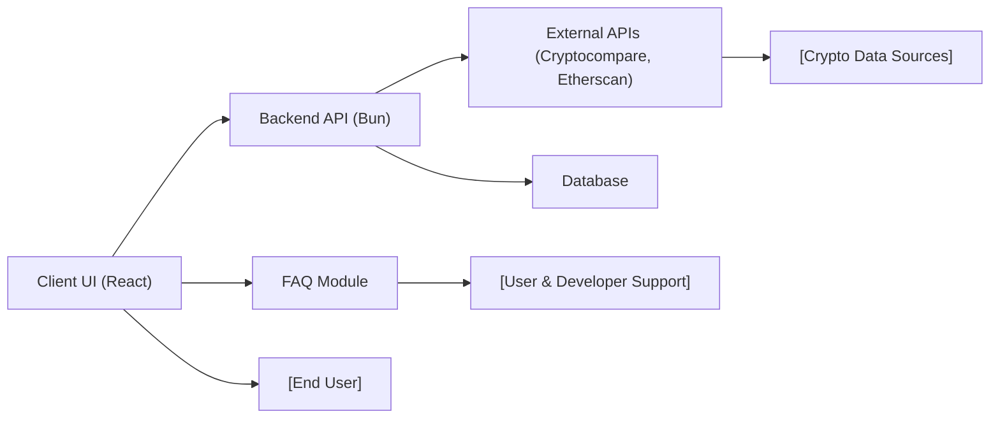

# Frequently Asked Questions (FAQ) – Shelfya Wallet Tracker

## Overview
This FAQ module provides users and developers with answers to common questions regarding the Shelfya Wallet Tracker system. It addresses user account management, wallet functionality, integration points, common errors, and other operational concerns to help users understand how different system modules interact and what to expect from the platform.

## Key Features

- **Account Management Clarifications**: Explains user registration, login, email verification, and password reset functionality.
- **Wallet & Portfolio Functionality**: Answers about wallet creation, deletion, statistics, and transaction history features.
- **Integration with External APIs**: Clarifies how and why data is fetched from third-party services like Cryptocompare and Etherscan.
- **Client & Backend Interaction**: Highlights the communication flow between the client UI and backend APIs.
- **Operational Guidance**: Provides information on project setup, running, and troubleshooting.
- **Error Troubleshooting**: Common errors and best practices to resolve or avoid them.

## System Errors

- **Authentication Failed**: Occurs when credentials are incorrect or the access token is invalid/expired.  
  **Resolution**: Ensure credentials are correct, the email is verified, and try refreshing the access token using `/auth/refresh-access-token`.

- **Wallet Not Found**: When querying/deleting a wallet that does not exist or is not associated with the logged-in user.  
  **Resolution**: Double-check wallet IDs, ensure you are logged in with the correct account, and the wallet is created.

- **External API Unavailable**: Failure when fetching portfolio or historical data due to unresponsive third-party APIs (Cryptocompare, Etherscan).  
  **Resolution**: Retry the request after some time or check API status pages.

- **Network/Connectivity Issues**: The client app cannot reach the backend server (e.g., during development).  
  **Resolution**: Make sure backend and client servers are running, and URLs/ports are configured properly.

- **Profile Update Error**: Issues when updating user information, possibly due to invalid data formats or server validation.  
  **Resolution**: Ensure data sent matches expected formats. Review error messages and fix highlighted issues.

## Usage Examples

```bash
# Register a new account
curl -X POST -d '{"email":"user@example.com","password":"securepass"}' http://localhost:PORT/api/v1/auth/register

# Login
curl -X POST -d '{"email":"user@example.com","password":"securepass"}' http://localhost:PORT/api/v1/auth/login

# Get list of wallets (after login, with access token)
curl -H "Authorization: Bearer <ACCESS_TOKEN>" http://localhost:PORT/api/v1/wallet

# Add a new wallet
curl -X POST -H "Authorization: Bearer <ACCESS_TOKEN>" -d '{"walletAddress":"0xABC..."}' http://localhost:PORT/api/v1/wallet

# Get wallet statistics
curl -H "Authorization: Bearer <ACCESS_TOKEN>" http://localhost:PORT/api/v1/wallet/portfolio/<walletId>
```

## System Integration


