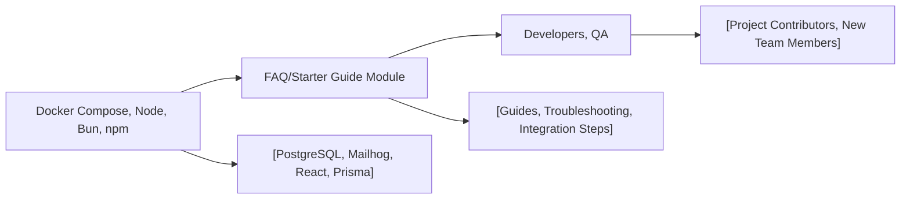

# Starter FAQ

## Overview
This FAQ module provides answers to common questions and troubleshooting tips for developers using the Shelfya starter project. It is designed to help new users quickly understand how core components (backend, database, frontend) work together, how to run the system, and how to resolve typical issues encountered when developing or deploying the project.

## Key Features

- **Quick Start Guidance**: Step-by-step instructions for setting up backend and frontend, including dependencies, environment, and commands.
- **Common Error Resolution**: Solutions and explanations for frequent problems during startup and development.
- **Development Workflow Support**: References for useful scripts and procedures for both backend and frontend teams.
- **System Overview**: High-level explanation of how services (backend, database, frontend) connect and interact.

## System Errors

- **Dependency Installation Issues**: Errors may occur if dependencies are not installed or are missing versions.
  - **Resolution**: Run `bun i` in the `backend` folder for backend dependencies and `npm install` in the `client` directory for frontend dependencies.
- **Database Connection Errors**: The backend may not start if PostgreSQL is not running or credentials are misconfigured.
  - **Resolution**: Ensure Docker is running, and environment variables (`POSTGRES_USER`, `POSTGRES_PASSWORD`, etc.) are set properly in `backend/docker-compose.yml`.
- **Port Conflicts**: Commonly, ports 3000 (frontend) and 5432 (database) may already be in use.
  - **Resolution**: Stop any services occupying those ports, or update the port mappings in Docker Compose or React scripts configuration files.
- **Mailhog Not Accessible**: If emails are not received during development.
  - **Resolution**: Access the Mailhog web interface on `http://localhost:8025` to view queued emails or verify Mailhog service is running by checking Docker Compose logs.

## Usage Examples

```bash
# Backend: Install dependencies, start the server, generate Prisma client
cd backend
bun i
bun dev
bunx prisma generate

# (If database migrations are needed)
bunx prisma migrate dev

# Frontend: Install dependencies and start the app
cd client
npm install
npm start

# To run the system services (database and mailhog) using Docker Compose
cd backend
docker compose up -d

# Access the frontend at: http://localhost:3000
# Access Mailhog web UI at: http://localhost:8025
```

## System Integration


