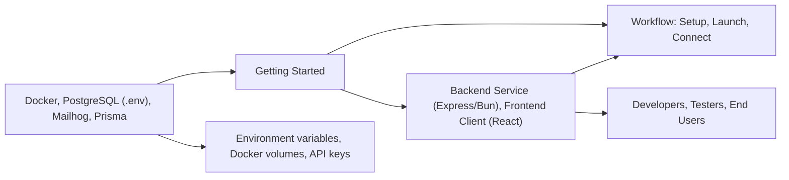

# Getting Started

## Overview
This guide helps you quickly set up and connect the Shelfya backend and frontend modules for local development. Shelfya is composed of an Express-based backend (using Bun and Prisma) and a React-based frontend. The system enables asset management, visualization, and user interaction through a web interface, leveraging a PostgreSQL database and Mailhog for email testing.

## Key Features
- **Backend Service (Express, Bun, Prisma)**: Provides REST APIs for asset management and user authentication, connects to PostgreSQL, and supports email sending via Mailhog.
- **Frontend Client (React)**: Offers interactive dashboards and data visualization, connects securely to the backend APIs.
- **Database Integration**: Uses PostgreSQL for persistent storage with Prisma ORM for type-safe queries.
- **Email Testing (Mailhog)**: Captures outbound emails for development without sending real messages.
- **Environment Configuration**: Uses `.env` variables for secrets, API keys, and database connections.
- **Docker-based Services**: Fast local setup for both PostgreSQL and Mailhog using Docker Compose.

## System Errors
- **Backend Database Connection Error**: Occurs when environment variables (e.g., `DATABASE_URL`) are missing or PostgreSQL is unavailable.  
  _Resolution_: Verify `.env` configuration and ensure Docker services are running.

- **Frontend API Connection Error**: Happens if the frontend cannot reach the backend API (wrong URL, backend not started).  
  _Resolution_: Check the backend server’s status and ensure the frontend is configured with the correct API endpoint.

- **Email Sending Failed (Mailhog)**: Backend email features may fail if Mailhog is not running or configured.  
  _Resolution_: Make sure Mailhog is up via Docker Compose and environment variables reference its SMTP port (1025).

## Usage Examples

```bash
# 1. Start required Docker services (PostgreSQL & Mailhog):
cd backend
docker compose up -d

# 2. Initialize backend dependencies and start API server:
bun i                # install backend dependencies
bunx prisma generate # generate Prisma client
bun dev              # start backend server (default: http://localhost:8080)

# 3. Prepare frontend and launch development server:
cd ../client
npm install          # install frontend dependencies
npm start            # start frontend (default: http://localhost:3000)

# 4. Access your app:
# - Frontend: http://localhost:3000
# - Backend API: http://localhost:8080
# - Mailhog Web UI: http://localhost:8025
```

## System Integration


